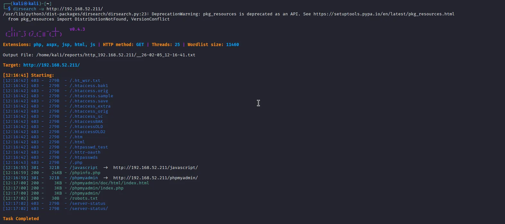
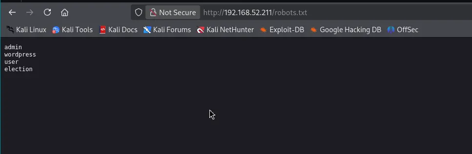
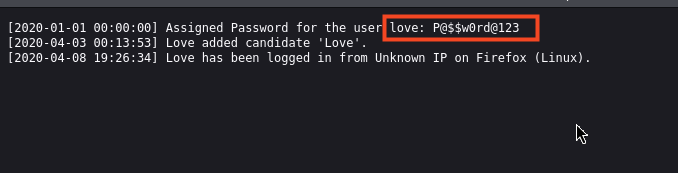
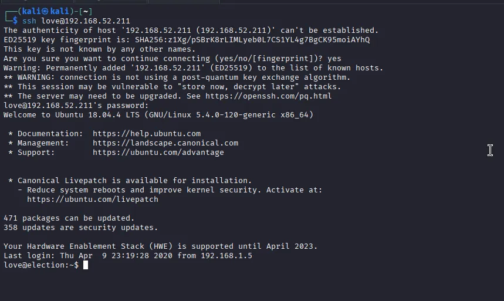
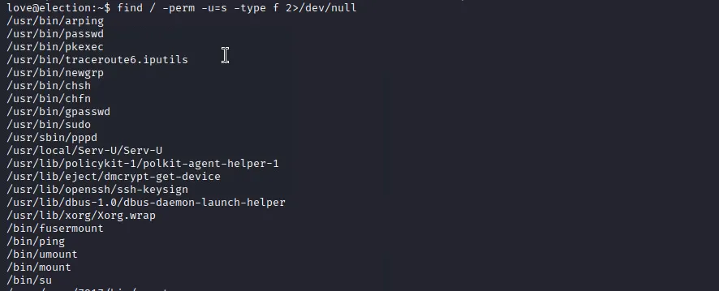
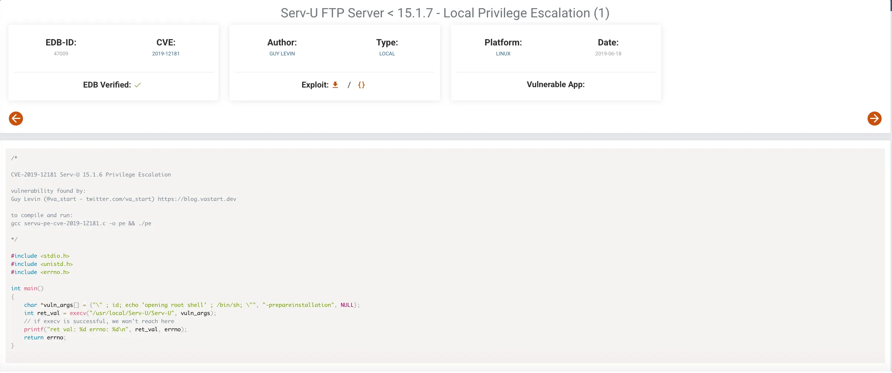
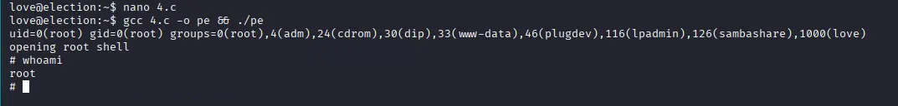

# Vulnhub: Election-1

## Reconnaissance:

So as always let’s start by listing all the TCP ports with nmap.

```bash
PORT   STATE SERVICE VERSION
22/tcp open  ssh     OpenSSH 7.6p1 Ubuntu 4ubuntu0.3 (Ubuntu Linux; protocol 2.0)
| ssh-hostkey: 
|   2048 20:d1:ed:84:cc:68:a5:a7:86:f0:da:b8:92:3f:d9:67 (RSA)
|   256 78:89:b3:a2:75:12:76:92:2a:f9:8d:27:c1:08:a7:b9 (ECDSA)
|_  256 b8:f4:d6:61:cf:16:90:c5:07:18:99:b0:7c:70:fd:c0 (ED25519)
80/tcp open  http    Apache httpd 2.4.29 ((Ubuntu))
|_http-server-header: Apache/2.4.29 (Ubuntu)
|_http-title: Apache2 Ubuntu Default Page: It works
Service Info: OS: Linux; CPE: cpe:/o:linux:linux_kernel

Service detection performed. Please report any incorrect results at https://nmap.org/submit/ .
Nmap done: 1 IP address (1 host up) scanned in 8.83 seconds

```

we discovered that 22 and 80 ports are open

---

# Enumeration

## Directory Brute Forcing

Using dirsearch, multiple interesting directories and files were discovered on the web server.

- `/phpinfo.php` (Status: 200).
- `/phpmyadmin/` (Status: 301/200).
- `/robots.txt` (Status: 200).
- `/election/` (Identified as a sub-directory).

Further scanning of the `/election/` directory revealed an admin panel and logs:

- `/election/admin/`
- `/election/admin/logs/`




---

# Exploitation

## Finding Credentials

By navigating to `/election/admin/logs/`, a file named system.log was discovered. Inside this log file, cleartext credentials for a user were found:

User: `love`
Password: `P@$$w0rd@123`




## Initial Access (SSH)

Using the discovered credentials, I successfully logged into the system via **SSH.

```bash

ssh love@192.168.52.211

```



---

# Privilege Escalation

## Enumerating SUID Bits

After gaining shell access, I searched for files with SUID permissions to find a path for privilege escalation.

```bash

find / -perm -u=s -type f 2>/dev/null

```
The search revealed an unusual SUID binary:

- /usr/local/Serv-U/Serv-U 




## Exploiting Serv-U

The version of Serv-U FTP Server was found to be vulnerable to a Local Privilege Escalation vulnerability (CVE-2019-12181) affecting versions `< 15.1.7`.

1. Exploit Source: [Exploit-DB 47009](https://www.exploit-db.com/exploits/47009).

2. Execution:

    + Created the exploit file: nano 4.c.

    + Compiled the code: gcc 4.c -o pe.

    + Ran the binary: ./pe.




---

# Final Result

The exploit successfully executed, providing a root shell.

```bash
# whoami
root

```



System Pwned.