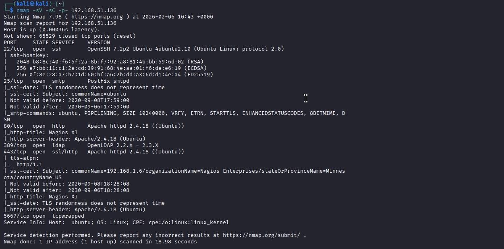
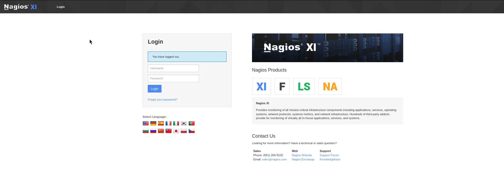
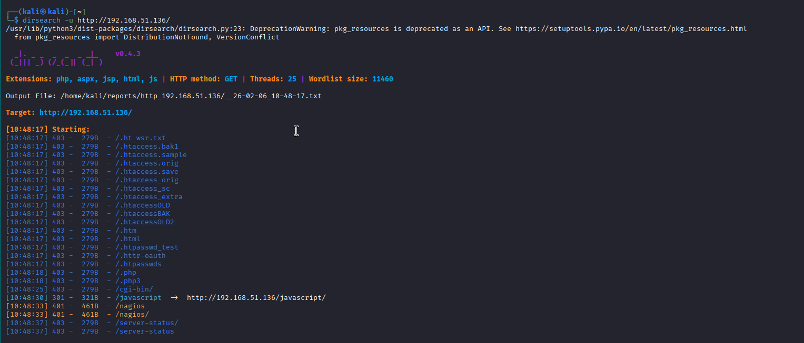
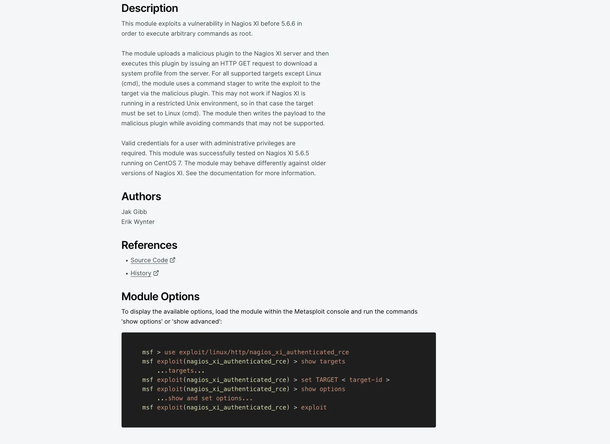
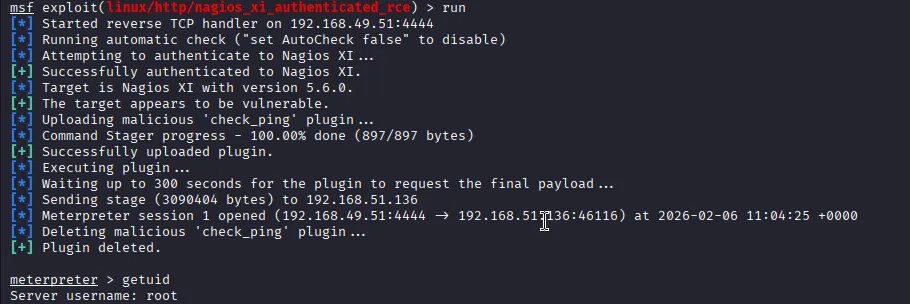

# Vulnhub: Monitoring

## Reconnaissance:

### Nmap

The assessment began with a network scan using NMAP to identify open ports and services. The scan revealed several interesting entry points:

+ Port 22/tcp: OpenSSH 7.2p2 Ubuntu 4ubuntu2.10.
+ Port 25/tcp: Postfix smtpd.
+ Port 80/tcp: Apache httpd 2.4.18 running Nagios XI.
+ Port 389/tcp: OpenLDAP 2.2.X - 2.3.X.
+ Port 443/tcp: Apache httpd 2.4.18 (SSL).
+ Port 5667/tcp: NSCA (Nagios Service Check Acceptor).

Upon visiting the web application on port 80, the Nagios XI login page was confirmed to be active.

### Directory Discovery (Dirsearch)

After identifying the web server on port 80 , a directory brute-force attack was performed using dirsearch to find hidden paths and administrative interfaces. This confirmed the presence of the Nagios XI installation and pointed toward the login portal.

## Vulnerability Research

Upon confirming that the target was running Nagios XI, research was conducted to find exploitable vulnerabilities. A critical vulnerability was found on Rapid7 affecting versions before 5.6.6.

+ Vulnerability Title: Nagios XI Authenticated Remote Code Execution.
+ Description: This exploit allows an authenticated user to upload a malicious plugin to the Nagios XI server. By requesting a system profile via HTTP GET, the server executes the plugin, leading to arbitrary command execution as root.

For more information you can visit this [website](https://www.rapid7.com/db/modules/exploit/linux/http/nagios_xi_authenticated_rce/)

## Exploitation Phase

### Credential Harvesting

The identified exploit requires valid administrative credentials. A search for default configurations led to a Nagios support forum:

+ Username: `nagiosadmin`
+ Password: `admin`

### Execution (Metasploit)

The Metasploit module `exploit/linux/http/nagios_xi_authenticated_rce` was utilized.

+ Authentication: The module successfully authenticated to the Nagios XI portal.
+ Version Check: The target was confirmed to be running Nagios XI 5.6.0, which is vulnerable.
+ Payload Delivery: A malicious check_ping plugin was uploaded.
+ Reverse Shell: The plugin was executed, and a Meterpreter session was opened.

## Post-Exploitation and Privilege Escalation

Once the session was established, the user privileges were verified:

+ Command: `getuid`
+ Output: Server username: `root` 

The exploit provided direct root access without requiring further privilege escalation steps..