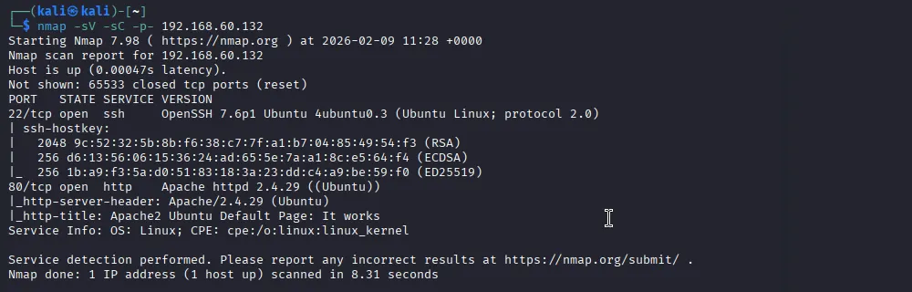
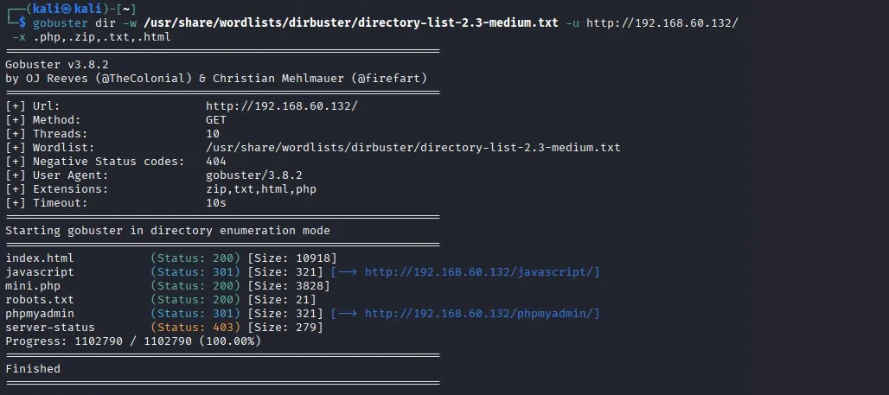
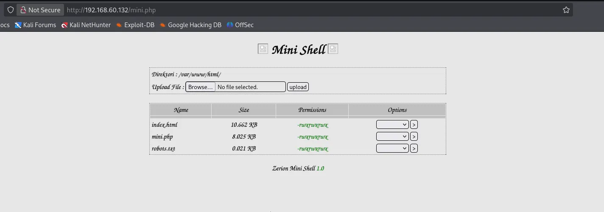
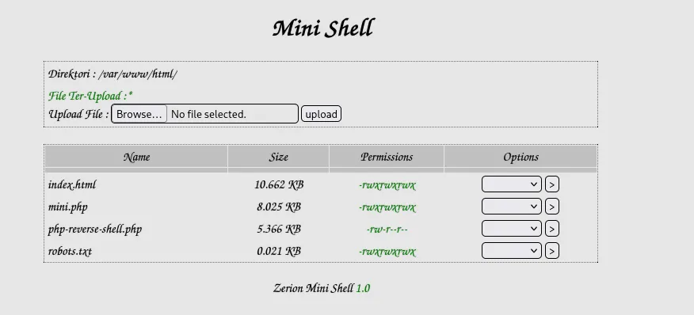
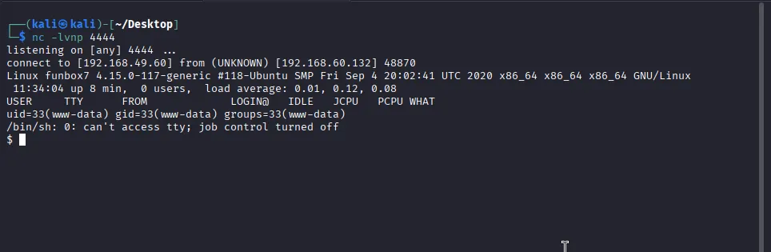
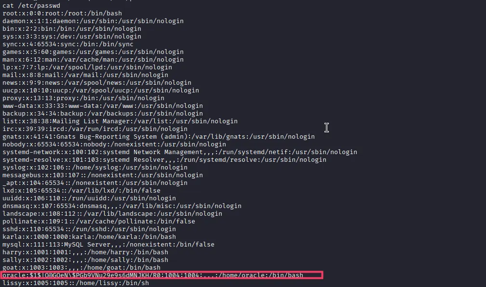
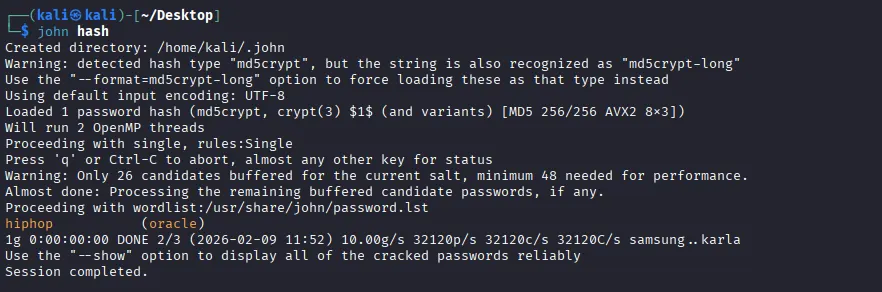
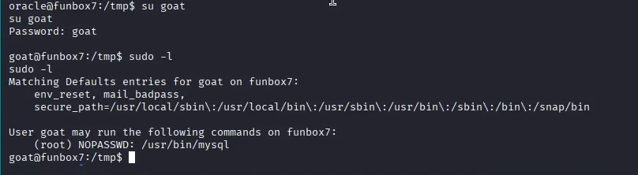
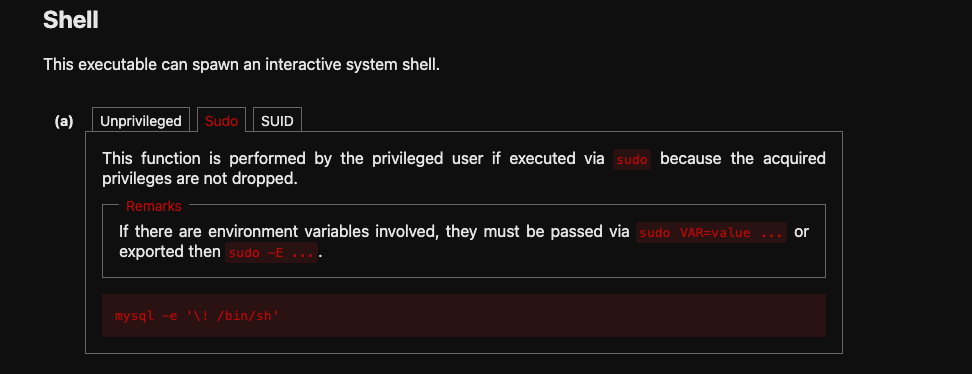
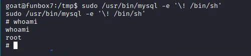

# Vulnhub: FunboxEasyEnum 

---

## 1. Reconnaissance (Enumeration)

Nmap Scan I started by scanning the target IP 192.168.60.132 to identify open ports and services. The scan revealed two open TCP ports:

+ Port 22: SSH (OpenSSH 7.6p1 Ubuntu)
+ Port 80: HTTP (Apache httpd 2.4.29) 

The Nmap output indicated the operating system is likely Ubuntu Linux.


Directory Brute-forcing Since Port 80 was open, I proceeded to enumerate directories using gobuster with a medium wordlist.

+ Command: gobuster `dir -u http://192.168.60.132/ -w /usr/share/wordlists/dirbuster/directory-list-2.3-medium.txt -x php,zip,txt,html`
+ Results: The scan discovered a file named `mini.php` (Status: 200) and `robots.txt`.




---


## 2. Initial Foothold

Web Exploitation I navigated to http://192.168.60.132/mini.php in the browser. The page hosted the "Zerion Mini Shell 1.0".

+ Vulnerability: This page allowed unauthenticated file uploads.
+ Exploitation: I uploaded a PHP reverse shell script (php-reverse-shell.php).

Getting a Reverse Shell

+ I set up a Netcat listener on my attacking machine: nc -lvnp 4444.
+ I accessed the uploaded file via the browser to trigger the script.
+ I successfully caught the reverse shell and logged in as the www-data user






---

## 3. Lateral Movement (User Escalation)

System Enumeration Once inside, I read the /etc/passwd file to identify users on the system. I found several standard users, including:

+ karla
+ harry
+ sally
+ goat
+ oracle
+ Lissy

Compromising User 'goat' I initially attempted to crack password hashes using John the Ripper, but the breakthrough came from checking for weak credentials manually.

+ I tried using the username as the password for the user goat.
+ Credentials Found: `goat : goat`.
+ I switched users using the command su goat and entered the password, successfully logging in as goat





---

## 4. Privilege Escalation (Root)


Sudo Rights Enumeration As the user goat, I checked for sudo privileges to see what commands I could run as root.

+ Command: sudo -l.
+ Result: The user goat can run /usr/bin/mysql as root without a password (NOPASSWD).

Exploiting MySQL I consulted GTFOBins to find a way to escape the MySQL shell and spawn a system shell.

Exploit Command:
```bash
sudo /usr/bin/mysql -e '\! /bin/sh'
```

This command executes the MySQL client as root and immediately uses the `\!` command to execute a system shell `(/bin/sh)`.
Root Access The exploit was successful. I ran whoami and confirmed I was root .






---

## Summary

The box was compromised by finding an exposed web shell (mini.php), uploading a reverse shell, guessing weak user credentials (goat:goat), and finally exploiting a sudo misconfiguration involving mysql to gain root privileges.